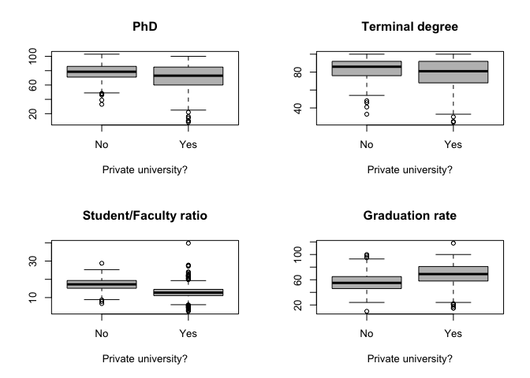
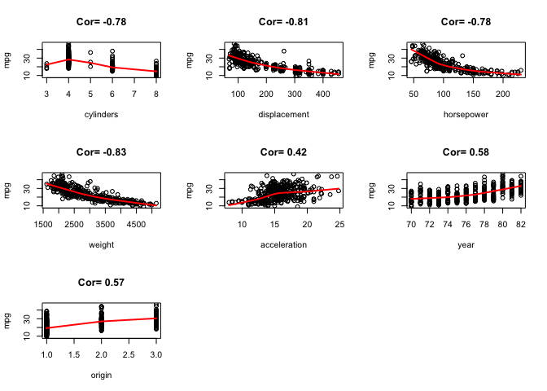
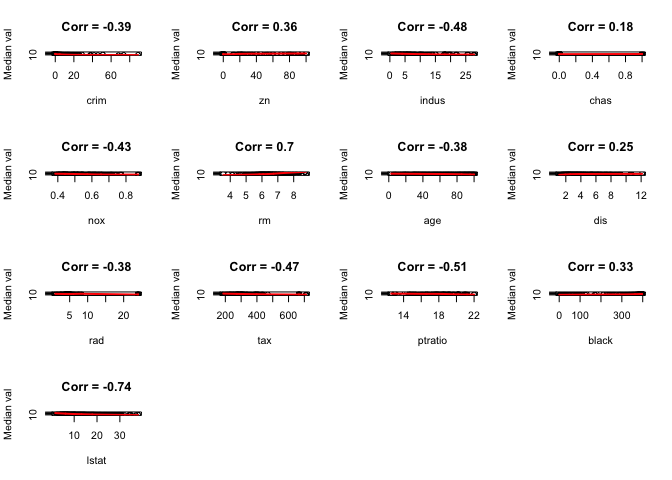

ISLR, Chapter 2
================

-   [Exercise 1](#exercise-1)
-   [Exercise 2](#exercise-2)
-   [Exercise 3](#exercise-3)
-   [Exercise 4](#exercise-4)
-   [Exercise 5](#exercise-5)
-   [Exercise 6](#exercise-6)
-   [Exercise 7](#exercise-7)
-   [Exercise 8](#exercise-8)
-   [Exercise 9](#exercise-9)
-   [Exercise 10](#exercise-10)

### Exercise 1

*a:* A flexible model will perform better than an inflexible model due to the large number of samples available.

*b:* A flexible model will perform worse than an inflexible model due to the small number of samples and large number of predictors.

*c:* A flexible model (e.g., non-linear regression) will perform better than an inflexible model (e.g., linear regression) because it will fit the data better. This means bias will decrease faster than variance will increase resulting in lower test error. A plot of test error vs. flexibility will show this.

*d:* A flexible model will perform worse since it will overfit to the noise

------------------------------------------------------------------------

### Exercise 2

*a:* Regression problem focussing on inference. *n* = 500; *p* = 3 (profit, \# employees, industry)

*b:* Classification problem focussing on prediction. *n* = 20; *p* = 13 (price, marketing budget, competition price + 10 other covariates)

*c:* Regression problem focussing on prediction. *n* = 52, *p* = 3 (% change in US, British & German markets)

------------------------------------------------------------------------

### Exercise 3

*a:* N/A

*b:*

-   Bias decreases with increase in model flexibility because model is able to fit data better
-   Variance increases with increase in model flexibility because changes in training set data can change model parameters a lot
-   Training error decreases with increase in model flexibility because model is able to fit data better resulting in lower Mean Squared Error
-   Test error initially decreases due to better fit (lower bias) from increase in model flexibility but then increases since variance increases faster than bias decreases
-   Bayes error does not change with model flexibility since it is based only on variance of errors and does not depend on nature of model

------------------------------------------------------------------------

### Exercise 4

*a:* Classification examples

-   Classify cancer tumor as malignant or benign. Response = Tumor status (malignant / benign); Predictors = expression values of various genes; Purpose = Prediction
-   Classify customer as likely to defect to competitor (or not). Response = Will defect / won't defect; Predictors = Days to contract end, availability of new phone, cost of plan, etc.; Purpose = prediction
-   Classify tweet as positive, negative or neutral based on sentiment analysis. Response = Sentiment status (positive, neutral, negative); Predictors = works in tweet; Purpose = Prediction

*b:* Regression examples

-   Predict daily temperature. Response = temperature; Predictors = temperature of past few days; cloud cover, amount of rain fall in pas few days, etc. Purpose = Prediction
-   Predict stock price. Response = stock price; Predictors = Price in recent days, Price of related stocks in recent days, price of related index in recent days, etc. Purpose = Prediction
-   Predict sales in next quarter. Response = sales in next quarter; Predictors = Sales in previous quarters, various market influencers; Purpose = Prediction

*c:* Cluster analysis examples

-   Identify market segments based on purchase history. Response = Market segment; Predictors = list of past purchases; Purpose = Inference
-   Cluster genes based on their expression profile in various samples. Response = cluster; Predictors = expression values of various genes; Purpose= Inference
-   Cluster pixels within image into sub-regions for border detection or object recognition. Response = region; Predictor = Values of pixels in neighborhood; Purpose = Inference

------------------------------------------------------------------------

### Exercise 5

Flexible models are characterized by low bias & high variance and lack of interpretability. A more flexible model will be useful when data is very non-linear (or separation boundary is very non-linear). A less flexible model will be useful when data is noisy (a more flexible model will end up fitting the noise). Also, more flexible models might be preferred when focus is on prediction (where model interpretability does not matter) rather than on inference (where understanding impact of each prediction on response is important).

------------------------------------------------------------------------

### Exercise 6

Both parametric and non-parametric models can be used to estimate `f` in `Y = f(X)`.

Parameteric models assume a certain functional form for the data and the model. This advantage of such a model is that it simplifies the problem of estimating `f` since we now need to estimate only the coefficients of the model instead of an arbitrary `p`-dimensional function `f(X)`. The disadvantage of such a model is that the model may not match the true form of data. Using a more flexible model with more parameters might result in overfitting to the training data.

Non-parametric models do not assume a functional form for the model. They are better able to adapt to the form of the data. However, they require a large amount of training data to obtain a good estimate of `f`.

------------------------------------------------------------------------

### Exercise 7

*a:* Euclidean distance = (3, 2, 3.16, 2.23, 1.41, 1.73)

*b:* `K = 1` =&gt; Y(new obs) = Green

*c:* `K = 3` =&gt; Y(new obs) = Red

*d:* If Bayes decision boundary is highly non-linear, use *small* `K` for best results since large `K` might mis-classify observations

------------------------------------------------------------------------

### Exercise 8

Analyze the `College` data set in the `ISLR` package

``` r
library(ISLR)
data(College)


# Column descriptions:
# 
# 1 - Private : Public/private indicator
# 2 - Apps : Number of applications received
# 3 - Accept : Number of applicants accepted
# 4 - Enroll : Number of new students enrolled
# 5 - Top10perc : New students from top 10 % of high school class
# 6 - Top25perc : New students from top 25 % of high school class 
# 7 - F.Undergrad : Number of full-time undergraduates
# 8 - P.Undergrad : Number of part-time undergraduates
# 9 - Outstate : Out-of-state tuition
# 10 - Room.Board : Room and board costs
# 11 - Books : Estimated book costs
# 12 - Personal : Estimated personal spending
# 13 - PhD : Percent of faculty with Ph.D.’s
# 14 - Terminal : Percent of faculty with terminal degree
# 15 - S.F.Ratio : Student/faculty ratio
# 16 - perc.alumni : Percent of alumni who donate
# 17 - Expend : Instructional expenditure per student
# 18 - Grad.Rate : Graduation rate

# Summary of College dataset
summary(College)
```

    ##  Private        Apps           Accept          Enroll       Top10perc    
    ##  No :212   Min.   :   81   Min.   :   72   Min.   :  35   Min.   : 1.00  
    ##  Yes:565   1st Qu.:  776   1st Qu.:  604   1st Qu.: 242   1st Qu.:15.00  
    ##            Median : 1558   Median : 1110   Median : 434   Median :23.00  
    ##            Mean   : 3002   Mean   : 2019   Mean   : 780   Mean   :27.56  
    ##            3rd Qu.: 3624   3rd Qu.: 2424   3rd Qu.: 902   3rd Qu.:35.00  
    ##            Max.   :48094   Max.   :26330   Max.   :6392   Max.   :96.00  
    ##    Top25perc      F.Undergrad     P.Undergrad         Outstate    
    ##  Min.   :  9.0   Min.   :  139   Min.   :    1.0   Min.   : 2340  
    ##  1st Qu.: 41.0   1st Qu.:  992   1st Qu.:   95.0   1st Qu.: 7320  
    ##  Median : 54.0   Median : 1707   Median :  353.0   Median : 9990  
    ##  Mean   : 55.8   Mean   : 3700   Mean   :  855.3   Mean   :10441  
    ##  3rd Qu.: 69.0   3rd Qu.: 4005   3rd Qu.:  967.0   3rd Qu.:12925  
    ##  Max.   :100.0   Max.   :31643   Max.   :21836.0   Max.   :21700  
    ##    Room.Board       Books           Personal         PhD        
    ##  Min.   :1780   Min.   :  96.0   Min.   : 250   Min.   :  8.00  
    ##  1st Qu.:3597   1st Qu.: 470.0   1st Qu.: 850   1st Qu.: 62.00  
    ##  Median :4200   Median : 500.0   Median :1200   Median : 75.00  
    ##  Mean   :4358   Mean   : 549.4   Mean   :1341   Mean   : 72.66  
    ##  3rd Qu.:5050   3rd Qu.: 600.0   3rd Qu.:1700   3rd Qu.: 85.00  
    ##  Max.   :8124   Max.   :2340.0   Max.   :6800   Max.   :103.00  
    ##     Terminal       S.F.Ratio      perc.alumni        Expend     
    ##  Min.   : 24.0   Min.   : 2.50   Min.   : 0.00   Min.   : 3186  
    ##  1st Qu.: 71.0   1st Qu.:11.50   1st Qu.:13.00   1st Qu.: 6751  
    ##  Median : 82.0   Median :13.60   Median :21.00   Median : 8377  
    ##  Mean   : 79.7   Mean   :14.09   Mean   :22.74   Mean   : 9660  
    ##  3rd Qu.: 92.0   3rd Qu.:16.50   3rd Qu.:31.00   3rd Qu.:10830  
    ##  Max.   :100.0   Max.   :39.80   Max.   :64.00   Max.   :56233  
    ##    Grad.Rate     
    ##  Min.   : 10.00  
    ##  1st Qu.: 53.00  
    ##  Median : 65.00  
    ##  Mean   : 65.46  
    ##  3rd Qu.: 78.00  
    ##  Max.   :118.00

``` r
# Scatter plot of 1st 10 covariates
pairs(College[,1:10])
```


``` r
# Number of out-of-state students in public & private universities
plot(College$Private, College$Outstate, col='grey', main="Out-of-state students in public/private universities", xlab="Private University", ylab="# Out-of-state students")
```


``` r
# Create new covariate to classify universities as Elite
elite = rep("No", nrow(College))
elite[College$Top10perc > 50] = "Yes"
elite = as.factor(elite)
College = data.frame(College, elite)

summary(elite)
```

    ##  No Yes 
    ## 699  78

``` r
table(College$elite, College$Private)
```

    ##      
    ##        No Yes
    ##   No  199 500
    ##   Yes  13  65

``` r
# Number of out-of-state students in elite universities
plot(College$elite, College$Outstate, col="grey", main="Out-of-state students in elite universities", xlab="Elite University", ylab="# Out-of-state students")
```


``` r
PrivateElite = paste(ifelse(College$Private=="Yes", "Prv", "Pub"), '-', ifelse(College$elite =="Yes", "Elt", "N-Elt"))

par(mar = c(7,7,4,2))
boxplot(College$Outstate ~ PrivateElite, col="grey", main="Out-of-state students by university type", las=2)
```


``` r
par.old = par
par(mar = c(2,1,1,1))
par(mfrow=c(6,3))

for (i in 2:18) { 
  hist(College[,i], col='grey', main=names(College[i])) 
}

par = par.old
```


``` r
par(mfrow=c(2,2))
boxplot(College$PhD ~ College$Private, main="PhD", xlab="Private university?", col='grey')
boxplot(College$Terminal ~ College$Private, main="Terminal degree", xlab="Private university?", col='grey')
boxplot(College$S.F.Ratio ~ College$Private, main="Student/Faculty ratio", xlab="Private university?", col='grey')
boxplot(College$Grad.Rate ~ College$Private, main="Graduation rate", xlab="Private university?", col='grey')
```



**Findings:**

-   Private universities have more out-of-state students than public universities
-   Elite universities have more out-of-state students than non-elite universities
-   Private elite universities have the most number of out-of-state students, followed by private elite, public elite and public non-elite universities
-   Public universities have more faculty members with PhDs and terminal degress than private universities
-   Private universities have lower student/faculty ratio & higher graduation rate than public universities

``` r
plot(College$Expend, College$Grad.Rate, main="Does student expenditure \naffect graduation rate?", xlab="Expenditure/student", ylab="Graduation rate")
lines(lowess(College$Expend, College$Grad.Rate), col='red', lwd=2)
```


``` r
plot(College$perc.alumni ~ as.factor(PrivateElite), col='grey', main="Who donates more?", xlab="University type", ylab="% alumni who donate")
```


**Findings:**

-   90% of colleges spend &lt; $15,000 per student. Graduation rate increases with expenditure/student.
-   Alumni of private elite universties donate more than all other types of universities

------------------------------------------------------------------------

### Exercise 9

Analyze the `Auto` data set in the `ISLR` package

``` r
data(Auto)

# Quantitative covariates
# 
# mpg
# cylinders
# displacement
# horsepower
# weight
# acceleration
# year

# Qualitative covariates
# 
# name
# origin
```

``` r
for (i in 1:(ncol(Auto)-1)) {
  print(paste(names(Auto)[i], ':', paste(range(Auto[i]), collapse='-'), ',', round(mean(Auto[,i]),2), ',', round(sd(Auto[,i]),2)))
}
```

    ## [1] "mpg : 9-46.6 , 23.45 , 7.81"
    ## [1] "cylinders : 3-8 , 5.47 , 1.71"
    ## [1] "displacement : 68-455 , 194.41 , 104.64"
    ## [1] "horsepower : 46-230 , 104.47 , 38.49"
    ## [1] "weight : 1613-5140 , 2977.58 , 849.4"
    ## [1] "acceleration : 8-24.8 , 15.54 , 2.76"
    ## [1] "year : 70-82 , 75.98 , 3.68"
    ## [1] "origin : 1-3 , 1.58 , 0.81"

``` r
A2 = Auto[-seq(10,85),]

for (i in 1:(ncol(A2)-1)) {
  print(paste(names(A2)[i], ':', paste(range(A2[i]), collapse='-'), ',', round(mean(A2[,i]),2), ',', round(sd(A2[,i]),2)))
}
```

    ## [1] "mpg : 11-46.6 , 24.4 , 7.87"
    ## [1] "cylinders : 3-8 , 5.37 , 1.65"
    ## [1] "displacement : 68-455 , 187.24 , 99.68"
    ## [1] "horsepower : 46-230 , 100.72 , 35.71"
    ## [1] "weight : 1649-4997 , 2935.97 , 811.3"
    ## [1] "acceleration : 8.5-24.8 , 15.73 , 2.69"
    ## [1] "year : 70-82 , 77.15 , 3.11"
    ## [1] "origin : 1-3 , 1.6 , 0.82"

``` r
pairs(Auto, pch=15, cex=0.6)
```


``` r
par(mfrow=c(3,3))
mpg = Auto[,1]
for (i in 2:(ncol(Auto)-1)) {
  corr = round(cor(mpg, Auto[,i]),2)
  plot(mpg ~ Auto[,i], xlab=names(Auto)[i], main=paste("Cor=", corr))
  lines(lowess(mpg ~ Auto[,i]), col='red', lwd=2)
}
```



**Findings**

-   From the above plots, `mpg` is strongly correlated with all other covariates in the data set and they should all be used to predict `mpg`.

------------------------------------------------------------------------

### Exercise 10

Analyze the `Boston` data set in the `MASS` package

``` r
library(MASS)
data(Boston)

# crim - per capita crime rate by town.
# zn - proportion of residential land zoned for lots over 25,000 sq.ft.
# indus - proportion of non-retail business acres per town.
# chas - Charles River dummy variable (= 1 if tract bounds river; 0 otherwise).
# nox - nitrogen oxides concentration (parts per 10 million).
# rm - average number of rooms per dwelling.
# age - proportion of owner-occupied units built prior to 1940.
# dis - weighted mean of distances to five Boston employment centres.
# rad - index of accessibility to radial highways.
# tax - full-value property-tax rate per $10,000.
# ptratio - pupil-teacher ratio by town.
# black - 1000(Bk - 0.63)^2 where Bk is the proportion of blacks by town.
# lstat - lower status of the population (percent).
# medv - median value of owner-occupied homes in $1000s.


dim(Boston)
```

    ## [1] 506  14

``` r
pairs(Boston)
```


``` r
# Median house value vs. other covariates
par(mfrow=c(4,4))
for (i in 1:(ncol(Boston)-1)) {
  corr = round(cor(Boston[,14], Boston[,i]),2)
  plot(Boston[,14] ~ Boston[,i], main=paste("Corr =", corr), xlab=names(Boston)[i], ylab="Median val")
  lines(lowess(Boston[,14] ~ Boston[,i]), col='red', lwd=2)
}

# Per capita crime rate vs. other covariates
par(mfrow=c(4,4))
```



``` r
for (i in 2:(ncol(Boston)-1)) {
  corr = round(cor(Boston[,1], Boston[,i]),2)
  plot(Boston[,1] ~ Boston[,i], main=paste("Corr =", corr), xlab=names(Boston)[i], ylab=names(Boston)[1])
  lines(lowess(Boston[,1] ~ Boston[,i]), col='red', lwd=2)
}
```


#### Association with per-capita crime rate

-   `zn` - Crime rate is highest when `zn = 0`
-   `indus` - Crime rate is highest when `indus` = 18.1
-   `chas` - Crime rate is higher when `chas = 0`
-   `nox` - Crime rate tends to increase with `nox`
-   `rm` - Crime rate tends to decrease with `rm`
-   `age` - Crime rate tends to increase with `age`, especially when `age > 80`
-   `dis` - Crime rate decreases with `dis` and is highest when `dis < 3`
-   `rad` - Crime rate is highest when `rad = 24`
-   `tax` - Crime rate tends to be highest when `tax = $666`
-   `ptratio` - Crime rate tends to be highest when `ptratio = 20.20`, which is the same set of dwellings for which `tax = $666`
-   `black` - There are more criminal activties when `black > 300`
-   `lstat` - Crime rate tends to increase with `lstat`
-   `medv` - Crime rate tends to decrease with `medv`, with crime rates being highest when `medv < $15,000`

``` r
# 0 = tract does not bound river
# 1 = tract bounds river
# 35 tracts bound the river
table(Boston$chas)
```

    ## 
    ##   0   1 
    ## 471  35

``` r
# median ptratio for towns in this dataset
median(unique(Boston$ptratio))
```

    ## [1] 17.7

How to define suburb and town based on dataset? Based on `ptratio`? Without this definition, it's hard to answer parts `(g)` and `(h)`.
