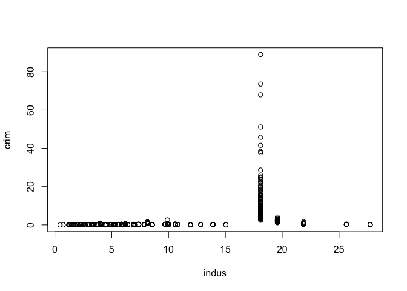
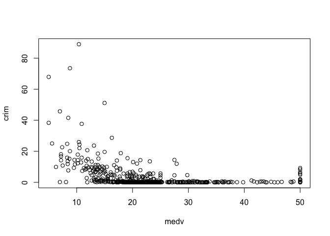
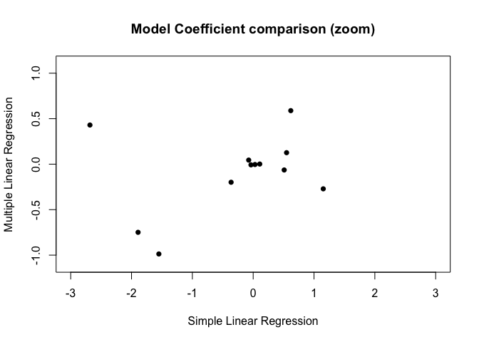

ISLR, Chapter 3
================

### Exercise 1

-   **Intercept** - Are there any sales in the absence of all advertising (Yes)
-   **TV** - Does TV advertising have an impact on sales (Yes; 46 additional units sold for every $1000 spent on TV ads)
-   **radio** - Does radio advertising have an impact on sales (Yes; 189 additional units sold for every $1000 spent on radio ads)
-   **newspaper** - Does newspaper advertising have an impact on sales (No; p-value = 0.86)

------------------------------------------------------------------------

### Exercise 2

Difference between KNN classification vs. KNN regression:

**KNN classification** - Used to predict the class of a point from its covariates. From the labelled training set, take the `K` points that are nearest to the new point in covariate space. The class of the new point is the class that is most common in the `K` points.

**KNN regression** - Used to predict the response of a point from its covariates. From the labelled training set, select the `K` nearest neighbors in covariate space. The response of the point to predict is the average of the response of these `K` points.

------------------------------------------------------------------------

### Exercise 3

Linear model:

`Salary = 50 + 20*GPA + 0.07*IQ + 35*Gender + 0.01*GPA:IQ - 10*GPA:Gender`

`Gender: Male = 0, Female = 1`

*a:* `F = 35 - 10*GPA`

`M = 0`

`M - F = 0 - (35 - 10*GPA) = 10*GPA - 35`

Males earn more than females on average only the fixed GPA is &gt; 3.5

*b:* Salary of female with IQ=110, GPA=4 is

``` r
50 + 20*4 + 0.07*110 + 35*1 + 0.01*4*110 - 10*4*1 
```

    ## [1] 137.1

*c:* Support for interaction effect is provided by its associated p-value. If p-value is low, then there is evidence for an interaction effect. Also, since scale of IQ is much larger than that of the other covariates(1-100+ vs 1-4 & 0-1), the coefficient for interaction will be small.

------------------------------------------------------------------------

### Exercise 4

*a:* Training RSS will be lower with the more complex cubic model since it can fit the data better (low bias, high variance model)

*b:* Test RSS is likely to be higher for the more complex cubic model due to overfitting.

*c:* Training RSS will still be lower for the more complex cubic model.

*d:* Not enough info to determine whether test RSS will be higher for more complex cubic model or not. If the true relationship is quadratic, then test RSS can be similar to the linear and cubic model. (?)

------------------------------------------------------------------------

### Exercise 5

------------------------------------------------------------------------

### Exercise 6

------------------------------------------------------------------------

### Exercise 7

------------------------------------------------------------------------

### Exercise 8

Simple linear regression on `Auto` data set

*(i):* There is a relationship between `mpg` and `horsepower` with `mpg` decreasing non-linearly with increase in horsepower.

``` r
library(ISLR)

plot(Auto$mpg ~ Auto$horsepower, xlab="horsepower", ylab="mpg")
lines(lowess(Auto$mpg ~ Auto$horsepower), col='red', lwd=3)
```


*(ii):* Correlation (strength & direction of linear relationship) between the 2 is:

``` r
cor(Auto$mpg, Auto$horsepower) 
```

    ## [1] -0.7784268

which is quite strong. Also, p-value for coefficient for `horsepower` is very low, suggesting that `mpg` does depend on `horsepower`.

*(iii):* The relationship is negative: `mpg` decreases as `horsepower` increases. This can be determined from the sign of the correlation and also from the sign of the coefficient for horsepower in the linear model below.

*(iv):* For `horsepower = 98`, predicted values with 95% intervals are:

``` r
m <- lm(Auto$mpg ~ Auto$horsepower)
m
```

    ## 
    ## Call:
    ## lm(formula = Auto$mpg ~ Auto$horsepower)
    ## 
    ## Coefficients:
    ##     (Intercept)  Auto$horsepower  
    ##         39.9359          -0.1578

``` r
summary(m)
```

    ## 
    ## Call:
    ## lm(formula = Auto$mpg ~ Auto$horsepower)
    ## 
    ## Residuals:
    ##      Min       1Q   Median       3Q      Max 
    ## -13.5710  -3.2592  -0.3435   2.7630  16.9240 
    ## 
    ## Coefficients:
    ##                  Estimate Std. Error t value Pr(>|t|)    
    ## (Intercept)     39.935861   0.717499   55.66   <2e-16 ***
    ## Auto$horsepower -0.157845   0.006446  -24.49   <2e-16 ***
    ## ---
    ## Signif. codes:  0 '***' 0.001 '**' 0.01 '*' 0.05 '.' 0.1 ' ' 1
    ## 
    ## Residual standard error: 4.906 on 390 degrees of freedom
    ## Multiple R-squared:  0.6059, Adjusted R-squared:  0.6049 
    ## F-statistic: 599.7 on 1 and 390 DF,  p-value: < 2.2e-16

``` r
# predict(m, data.frame(horsepower=c(98)), interval="confidence")
# predict(m, data.frame(horsepower=c(98)), interval="prediction")
```

When `horsepower = 98`, predicted `mpg = 24.47`. 95% confidence interval is `(23.97, 24.96)` and 95% prediction interval is `(14.81, 34.13)`

*b:* The linear model is not a good fit for the data. The `lowess` line shows the fit of a non-parametric regression model that fits the data a lot better.

``` r
plot(Auto$mpg ~ Auto$horsepower, xlab="horsepower", ylab="mpg")
lines(lowess(Auto$mpg ~ Auto$horsepower), col='red', lwd=3)
abline(m, col='blue', lwd=3)
legend("topright", c("Lowess line", "Linear model"), col=c("red", "blue"), lwd=3)
```


*c:* From the linear regression diagnostic plots below, we see that there is a definite pattern in the `residuals vs. fitted values` plot, suggesting that the simple linear model above is not a good fit for the data.

``` r
par(mfrow=c(2,2))
plot(m)
```


------------------------------------------------------------------------

### Exercise 9

Multiple liner regression on `Auto` data set \* Convert `origin` from number to factor \* Exlcude `name` from scatterplot matrix of variables

*a:*

``` r
plot(Auto[,-ncol(Auto)])
```

 \* `mpg` decreases with `cylinders`, `displacement`, `horsepower` & `weight` \* `mpg` increases with `acceleration`, `year` and `origin` (Japanese &gt; European &gt; American)

*b:*

``` r
round(cor(Auto[,-c(8,9)]), 2)
```

    ##                mpg cylinders displacement horsepower weight acceleration
    ## mpg           1.00     -0.78        -0.81      -0.78  -0.83         0.42
    ## cylinders    -0.78      1.00         0.95       0.84   0.90        -0.50
    ## displacement -0.81      0.95         1.00       0.90   0.93        -0.54
    ## horsepower   -0.78      0.84         0.90       1.00   0.86        -0.69
    ## weight       -0.83      0.90         0.93       0.86   1.00        -0.42
    ## acceleration  0.42     -0.50        -0.54      -0.69  -0.42         1.00
    ## year          0.58     -0.35        -0.37      -0.42  -0.31         0.29
    ##               year
    ## mpg           0.58
    ## cylinders    -0.35
    ## displacement -0.37
    ## horsepower   -0.42
    ## weight       -0.31
    ## acceleration  0.29
    ## year          1.00

*c:*

``` r
m <- lm(mpg ~ .-name, data=Auto)
summary(m)
```

    ## 
    ## Call:
    ## lm(formula = mpg ~ . - name, data = Auto)
    ## 
    ## Residuals:
    ##     Min      1Q  Median      3Q     Max 
    ## -9.5903 -2.1565 -0.1169  1.8690 13.0604 
    ## 
    ## Coefficients:
    ##                Estimate Std. Error t value Pr(>|t|)    
    ## (Intercept)  -17.218435   4.644294  -3.707  0.00024 ***
    ## cylinders     -0.493376   0.323282  -1.526  0.12780    
    ## displacement   0.019896   0.007515   2.647  0.00844 ** 
    ## horsepower    -0.016951   0.013787  -1.230  0.21963    
    ## weight        -0.006474   0.000652  -9.929  < 2e-16 ***
    ## acceleration   0.080576   0.098845   0.815  0.41548    
    ## year           0.750773   0.050973  14.729  < 2e-16 ***
    ## origin         1.426141   0.278136   5.127 4.67e-07 ***
    ## ---
    ## Signif. codes:  0 '***' 0.001 '**' 0.01 '*' 0.05 '.' 0.1 ' ' 1
    ## 
    ## Residual standard error: 3.328 on 384 degrees of freedom
    ## Multiple R-squared:  0.8215, Adjusted R-squared:  0.8182 
    ## F-statistic: 252.4 on 7 and 384 DF,  p-value: < 2.2e-16

-   There is a relationship between `mpg` and covariates since p-values for the model coefficients for `displacement`, `weight`, `year` and `origin` and &lt;&lt; 0.05.
-   Coefficient for `year` suggests that `mpg` increases by 0.78 per year.

*d:*

``` r
par(mfrow=c(2,2))
plot(m)
```


-   Residuals vs. fitted values plot shows a non-linear relationship between response and covariates
-   A few points with large estimates for `mpg` are marked as outliers `(323, 326, 327)`
-   Residuals vs. Leverage plot also marks point `14` as having high leverage

*e:*

``` r
m2 <- lm(mpg ~ (.-name)*(.-name), data=Auto)
summary(m2)
```

    ## 
    ## Call:
    ## lm(formula = mpg ~ (. - name) * (. - name), data = Auto)
    ## 
    ## Residuals:
    ##     Min      1Q  Median      3Q     Max 
    ## -7.6303 -1.4481  0.0596  1.2739 11.1386 
    ## 
    ## Coefficients:
    ##                             Estimate Std. Error t value Pr(>|t|)   
    ## (Intercept)                3.548e+01  5.314e+01   0.668  0.50475   
    ## cylinders                  6.989e+00  8.248e+00   0.847  0.39738   
    ## displacement              -4.785e-01  1.894e-01  -2.527  0.01192 * 
    ## horsepower                 5.034e-01  3.470e-01   1.451  0.14769   
    ## weight                     4.133e-03  1.759e-02   0.235  0.81442   
    ## acceleration              -5.859e+00  2.174e+00  -2.696  0.00735 **
    ## year                       6.974e-01  6.097e-01   1.144  0.25340   
    ## origin                    -2.090e+01  7.097e+00  -2.944  0.00345 **
    ## cylinders:displacement    -3.383e-03  6.455e-03  -0.524  0.60051   
    ## cylinders:horsepower       1.161e-02  2.420e-02   0.480  0.63157   
    ## cylinders:weight           3.575e-04  8.955e-04   0.399  0.69000   
    ## cylinders:acceleration     2.779e-01  1.664e-01   1.670  0.09584 . 
    ## cylinders:year            -1.741e-01  9.714e-02  -1.793  0.07389 . 
    ## cylinders:origin           4.022e-01  4.926e-01   0.816  0.41482   
    ## displacement:horsepower   -8.491e-05  2.885e-04  -0.294  0.76867   
    ## displacement:weight        2.472e-05  1.470e-05   1.682  0.09342 . 
    ## displacement:acceleration -3.479e-03  3.342e-03  -1.041  0.29853   
    ## displacement:year          5.934e-03  2.391e-03   2.482  0.01352 * 
    ## displacement:origin        2.398e-02  1.947e-02   1.232  0.21875   
    ## horsepower:weight         -1.968e-05  2.924e-05  -0.673  0.50124   
    ## horsepower:acceleration   -7.213e-03  3.719e-03  -1.939  0.05325 . 
    ## horsepower:year           -5.838e-03  3.938e-03  -1.482  0.13916   
    ## horsepower:origin          2.233e-03  2.930e-02   0.076  0.93931   
    ## weight:acceleration        2.346e-04  2.289e-04   1.025  0.30596   
    ## weight:year               -2.245e-04  2.127e-04  -1.056  0.29182   
    ## weight:origin             -5.789e-04  1.591e-03  -0.364  0.71623   
    ## acceleration:year          5.562e-02  2.558e-02   2.174  0.03033 * 
    ## acceleration:origin        4.583e-01  1.567e-01   2.926  0.00365 **
    ## year:origin                1.393e-01  7.399e-02   1.882  0.06062 . 
    ## ---
    ## Signif. codes:  0 '***' 0.001 '**' 0.01 '*' 0.05 '.' 0.1 ' ' 1
    ## 
    ## Residual standard error: 2.695 on 363 degrees of freedom
    ## Multiple R-squared:  0.8893, Adjusted R-squared:  0.8808 
    ## F-statistic: 104.2 on 28 and 363 DF,  p-value: < 2.2e-16

Covariates & interactions significant at the 5% level are:

-   `acceleration`
-   `origin2`
-   `origin3`
-   `acceleration:cylinders`
-   `acceleration:year`
-   `acceleration:origin2`
-   `acceleration:origin3`
-   `year:origin2`
-   `year:origin3`

*f:*

`TODO`

------------------------------------------------------------------------

### Exercise 10

------------------------------------------------------------------------

### Exercise 11

------------------------------------------------------------------------

### Exercise 12

------------------------------------------------------------------------

### Exercise 13

------------------------------------------------------------------------

### Exercise 14

------------------------------------------------------------------------

### Exercise 15

*a:* Simple linear regression of`crim` vs. each covariate. When fitting a linear model of `crim` against each of the covariates separately, all covariates are associsted with `crim` (p-value &lt; 0.05 for model coefficient term for covariate). The plots below show how `crim` changes with each covariate.

``` r
library(MASS)
data(Boston)

m1.coef <- vector(mode="numeric", length=length(names(Boston)) - 1)

for (i in 2:length(Boston)) {
  plot(Boston[,1] ~ Boston[,i], xlab=names(Boston)[i], ylab=names(Boston)[1])
  
  m <- lm(Boston[,1] ~ Boston[,i])
  
  cf = names(Boston)[i]
  cfsum = summary(m)$coefficients
  
  m1.coef[i-1] <- cfsum[2,1]
  ifelse(cfsum[2,4] < 0.05, print(paste(cf, ': YES')), print(paste(cf, ': NO')) )
}
```


    ## [1] "zn : YES"



    ## [1] "indus : YES"


    ## [1] "chas : NO"


    ## [1] "nox : YES"


    ## [1] "rm : YES"


    ## [1] "age : YES"


    ## [1] "dis : YES"


    ## [1] "rad : YES"


    ## [1] "tax : YES"


    ## [1] "ptratio : YES"


    ## [1] "black : YES"


    ## [1] "lstat : YES"



    ## [1] "medv : YES"

*b:* Multiple linear regression of `crim` vs. all covariates.

From the model summary, only the covariates below are statistically significant, so we can reject the null hypothesis `H_0: B_j = 0`

-   `zn`
-   `dis`
-   `rad`
-   `black`
-   `medv`

``` r
m2 <- lm(crim ~ .-crim, data=Boston)
summary(m2)
```

    ## 
    ## Call:
    ## lm(formula = crim ~ . - crim, data = Boston)
    ## 
    ## Residuals:
    ##    Min     1Q Median     3Q    Max 
    ## -9.924 -2.120 -0.353  1.019 75.051 
    ## 
    ## Coefficients:
    ##               Estimate Std. Error t value Pr(>|t|)    
    ## (Intercept)  17.033228   7.234903   2.354 0.018949 *  
    ## zn            0.044855   0.018734   2.394 0.017025 *  
    ## indus        -0.063855   0.083407  -0.766 0.444294    
    ## chas         -0.749134   1.180147  -0.635 0.525867    
    ## nox         -10.313535   5.275536  -1.955 0.051152 .  
    ## rm            0.430131   0.612830   0.702 0.483089    
    ## age           0.001452   0.017925   0.081 0.935488    
    ## dis          -0.987176   0.281817  -3.503 0.000502 ***
    ## rad           0.588209   0.088049   6.680 6.46e-11 ***
    ## tax          -0.003780   0.005156  -0.733 0.463793    
    ## ptratio      -0.271081   0.186450  -1.454 0.146611    
    ## black        -0.007538   0.003673  -2.052 0.040702 *  
    ## lstat         0.126211   0.075725   1.667 0.096208 .  
    ## medv         -0.198887   0.060516  -3.287 0.001087 ** 
    ## ---
    ## Signif. codes:  0 '***' 0.001 '**' 0.01 '*' 0.05 '.' 0.1 ' ' 1
    ## 
    ## Residual standard error: 6.439 on 492 degrees of freedom
    ## Multiple R-squared:  0.454,  Adjusted R-squared:  0.4396 
    ## F-statistic: 31.47 on 13 and 492 DF,  p-value: < 2.2e-16

``` r
m2.coef = coef(m2)[-1]
```

*c:* More covariates are statistically significant when `crim` is regressed separately against each of them separately. Coefficient for `nox` is very different between the 2 models. Coefficients for other covariates are more similar in comparison.

``` r
df <- cbind(m1.coef, m2.coef)
plot(df, main='Model Coefficient comparison', xlab='Simple Linear Regression', ylab='Multiple Linear Regression')
```


``` r
plot(df, main='Model Coefficient comparison (zoom)', xlab='Simple Linear Regression', ylab='Multiple Linear Regression', xlim=c(-3,3), ylim=c(-1.1,1.1), pch=16)
```


