ISLR, Chapter 3
================

-   [Exercise 1](#exercise-1)
-   [Exercise 2](#exercise-2)
-   [Exercise 3](#exercise-3)
-   [Exercise 4](#exercise-4)
-   [Exercise 5](#exercise-5)
-   [Exercise 6](#exercise-6)
-   [Exercise 7](#exercise-7)
-   [Exercise 8](#exercise-8)
-   [Exercise 9](#exercise-9)
-   [Exercise 10](#exercise-10)
-   [Exercise 11](#exercise-11)
-   [Exercise 12](#exercise-12)
-   [Exercise 13](#exercise-13)
-   [Exercise 14](#exercise-14)
-   [Exercise 15](#exercise-15)

### Exercise 1

-   **Intercept** - Are there any sales in the absence of all advertising (Yes)
-   **TV** - Does TV advertising have an impact on sales (Yes; 46 additional units sold for every $1000 spent on TV ads)
-   **radio** - Does radio advertising have an impact on sales (Yes; 189 additional units sold for every $1000 spent on radio ads)
-   **newspaper** - Does newspaper advertising have an impact on sales (No; p-value = 0.86)

------------------------------------------------------------------------

### Exercise 2

Difference between KNN classification vs. KNN regression:

**KNN classification** - Used to predict the class of a point from its covariates. From the labelled training set, take the `K` points that are nearest to the new point in covariate space. The class of the new point is the class that is most common in the `K` points.

**KNN regression** - Used to predict the response of a point from its covariates. From the labelled training set, select the `K` nearest neighbors in covariate space. The response of the point to predict is the average of the response of these `K` points.

------------------------------------------------------------------------

### Exercise 3

Linear model:

`Salary = 50 + 20*GPA + 0.07*IQ + 35*Gender + 0.01*GPA:IQ - 10*GPA:Gender`

`Gender: Male = 0, Female = 1`

*a:* `F = 35 - 10*GPA`

`M = 0`

`M - F = 0 - (35 - 10*GPA) = 10*GPA - 35`

Males earn more than females on average only the fixed GPA is &gt; 3.5

*b:* Salary of female with IQ=110, GPA=4 is

``` r
50 + 20*4 + 0.07*110 + 35*1 + 0.01*4*110 - 10*4*1 
```

    ## [1] 137.1

*c:* Support for interaction effect is provided by its associated p-value. If p-value is low, then there is evidence for an interaction effect. Also, since scale of IQ is much larger than that of the other covariates(1-100+ vs 1-4 & 0-1), the coefficient for interaction will be small.

------------------------------------------------------------------------

### Exercise 4

*a:* Training RSS will be lower with the more complex cubic model since it can fit the data better (low bias, high variance model)

*b:* Test RSS is likely to be higher for the more complex cubic model due to overfitting.

*c:* Training RSS will still be lower for the more complex cubic model.

*d:* Not enough info to determine whether test RSS will be higher for more complex cubic model or not. If the true relationship is quadratic, then test RSS can be similar to the linear and cubic model. (?)

------------------------------------------------------------------------

### Exercise 5

------------------------------------------------------------------------

### Exercise 6

------------------------------------------------------------------------

### Exercise 7

------------------------------------------------------------------------

### Exercise 8

Simple linear regression on `Auto` data set

*(i):* There is a relationship between `mpg` and `horsepower` with `mpg` decreasing non-linearly with increase in horsepower.

``` r
library(ISLR)

plot(Auto$mpg ~ Auto$horsepower, xlab="horsepower", ylab="mpg")
lines(lowess(Auto$mpg ~ Auto$horsepower), col='red', lwd=3)
```


*(ii):* Correlation (strength & direction of linear relationship) between the 2 is:

``` r
cor(Auto$mpg, Auto$horsepower) 
```

    ## [1] -0.7784268

which is quite strong. Also, p-value for coefficient for `horsepower` is very low, suggesting that `mpg` does depend on `horsepower`.

*(iii):* The relationship is negative: `mpg` decreases as `horsepower` increases. This can be determined from the sign of the correlation and also from the sign of the coefficient for horsepower in the linear model below.

*(iv):* For `horsepower = 98`, predicted values with 95% intervals are:

``` r
m <- lm(Auto$mpg ~ Auto$horsepower)
m
```

    ## 
    ## Call:
    ## lm(formula = Auto$mpg ~ Auto$horsepower)
    ## 
    ## Coefficients:
    ##     (Intercept)  Auto$horsepower  
    ##         39.9359          -0.1578

``` r
summary(m)
```

    ## 
    ## Call:
    ## lm(formula = Auto$mpg ~ Auto$horsepower)
    ## 
    ## Residuals:
    ##      Min       1Q   Median       3Q      Max 
    ## -13.5710  -3.2592  -0.3435   2.7630  16.9240 
    ## 
    ## Coefficients:
    ##                  Estimate Std. Error t value Pr(>|t|)    
    ## (Intercept)     39.935861   0.717499   55.66   <2e-16 ***
    ## Auto$horsepower -0.157845   0.006446  -24.49   <2e-16 ***
    ## ---
    ## Signif. codes:  0 '***' 0.001 '**' 0.01 '*' 0.05 '.' 0.1 ' ' 1
    ## 
    ## Residual standard error: 4.906 on 390 degrees of freedom
    ## Multiple R-squared:  0.6059, Adjusted R-squared:  0.6049 
    ## F-statistic: 599.7 on 1 and 390 DF,  p-value: < 2.2e-16

``` r
# predict(m, data.frame(horsepower=c(98)), interval="confidence")
# predict(m, data.frame(horsepower=c(98)), interval="prediction")
```

When `horsepower = 98`, predicted `mpg = 24.47`. 95% confidence interval is `(23.97, 24.96)` and 95% prediction interval is `(14.81, 34.13)`

*b:* The linear model is not a good fit for the data. The `lowess` line shows the fit of a non-parametric regression model that fits the data a lot better.

``` r
plot(Auto$mpg ~ Auto$horsepower, xlab="horsepower", ylab="mpg")
lines(lowess(Auto$mpg ~ Auto$horsepower), col='red', lwd=3)
abline(m, col='blue', lwd=3)
legend("topright", c("Lowess line", "Linear model"), col=c("red", "blue"), lwd=3)
```


*c:* From the linear regression diagnostic plots below, we see that there is a definite pattern in the `residuals vs. fitted values` plot, suggesting that the simple linear model above is not a good fit for the data.

``` r
par(mfrow=c(2,2))
plot(m)
```


------------------------------------------------------------------------

### Exercise 9

Multiple liner regression on `Auto` data set \* Convert `origin` from number to factor \* Exlcude `name` from scatterplot matrix of variables

*a:*

``` r
plot(Auto[,-ncol(Auto)])
```

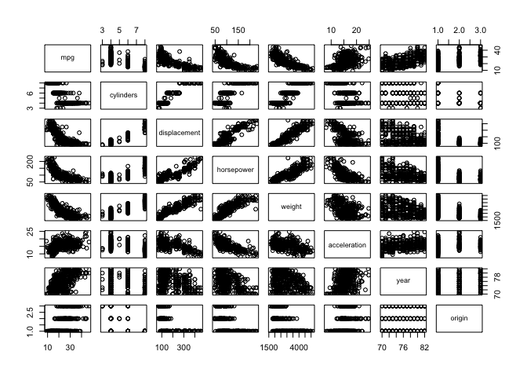 \* `mpg` decreases with `cylinders`, `displacement`, `horsepower` & `weight` \* `mpg` increases with `acceleration`, `year` and `origin` (Japanese &gt; European &gt; American)

*b:*

``` r
round(cor(Auto[,-c(8,9)]), 2)
```

    ##                mpg cylinders displacement horsepower weight acceleration
    ## mpg           1.00     -0.78        -0.81      -0.78  -0.83         0.42
    ## cylinders    -0.78      1.00         0.95       0.84   0.90        -0.50
    ## displacement -0.81      0.95         1.00       0.90   0.93        -0.54
    ## horsepower   -0.78      0.84         0.90       1.00   0.86        -0.69
    ## weight       -0.83      0.90         0.93       0.86   1.00        -0.42
    ## acceleration  0.42     -0.50        -0.54      -0.69  -0.42         1.00
    ## year          0.58     -0.35        -0.37      -0.42  -0.31         0.29
    ##               year
    ## mpg           0.58
    ## cylinders    -0.35
    ## displacement -0.37
    ## horsepower   -0.42
    ## weight       -0.31
    ## acceleration  0.29
    ## year          1.00

*c:*

``` r
m <- lm(mpg ~ .-name, data=Auto)
summary(m)
```

    ## 
    ## Call:
    ## lm(formula = mpg ~ . - name, data = Auto)
    ## 
    ## Residuals:
    ##     Min      1Q  Median      3Q     Max 
    ## -9.5903 -2.1565 -0.1169  1.8690 13.0604 
    ## 
    ## Coefficients:
    ##                Estimate Std. Error t value Pr(>|t|)    
    ## (Intercept)  -17.218435   4.644294  -3.707  0.00024 ***
    ## cylinders     -0.493376   0.323282  -1.526  0.12780    
    ## displacement   0.019896   0.007515   2.647  0.00844 ** 
    ## horsepower    -0.016951   0.013787  -1.230  0.21963    
    ## weight        -0.006474   0.000652  -9.929  < 2e-16 ***
    ## acceleration   0.080576   0.098845   0.815  0.41548    
    ## year           0.750773   0.050973  14.729  < 2e-16 ***
    ## origin         1.426141   0.278136   5.127 4.67e-07 ***
    ## ---
    ## Signif. codes:  0 '***' 0.001 '**' 0.01 '*' 0.05 '.' 0.1 ' ' 1
    ## 
    ## Residual standard error: 3.328 on 384 degrees of freedom
    ## Multiple R-squared:  0.8215, Adjusted R-squared:  0.8182 
    ## F-statistic: 252.4 on 7 and 384 DF,  p-value: < 2.2e-16

-   There is a relationship between `mpg` and covariates since p-values for the model coefficients for `displacement`, `weight`, `year` and `origin` and &lt;&lt; 0.05.
-   Coefficient for `year` suggests that `mpg` increases by 0.78 per year.

*d:*

``` r
par(mfrow=c(2,2))
plot(m)
```


-   Residuals vs. fitted values plot shows a non-linear relationship between response and covariates
-   A few points with large estimates for `mpg` are marked as outliers `(323, 326, 327)`
-   Residuals vs. Leverage plot also marks point `14` as having high leverage

*e:*

``` r
m2 <- lm(mpg ~ (.-name)*(.-name), data=Auto)
summary(m2)
```

    ## 
    ## Call:
    ## lm(formula = mpg ~ (. - name) * (. - name), data = Auto)
    ## 
    ## Residuals:
    ##     Min      1Q  Median      3Q     Max 
    ## -7.6303 -1.4481  0.0596  1.2739 11.1386 
    ## 
    ## Coefficients:
    ##                             Estimate Std. Error t value Pr(>|t|)   
    ## (Intercept)                3.548e+01  5.314e+01   0.668  0.50475   
    ## cylinders                  6.989e+00  8.248e+00   0.847  0.39738   
    ## displacement              -4.785e-01  1.894e-01  -2.527  0.01192 * 
    ## horsepower                 5.034e-01  3.470e-01   1.451  0.14769   
    ## weight                     4.133e-03  1.759e-02   0.235  0.81442   
    ## acceleration              -5.859e+00  2.174e+00  -2.696  0.00735 **
    ## year                       6.974e-01  6.097e-01   1.144  0.25340   
    ## origin                    -2.090e+01  7.097e+00  -2.944  0.00345 **
    ## cylinders:displacement    -3.383e-03  6.455e-03  -0.524  0.60051   
    ## cylinders:horsepower       1.161e-02  2.420e-02   0.480  0.63157   
    ## cylinders:weight           3.575e-04  8.955e-04   0.399  0.69000   
    ## cylinders:acceleration     2.779e-01  1.664e-01   1.670  0.09584 . 
    ## cylinders:year            -1.741e-01  9.714e-02  -1.793  0.07389 . 
    ## cylinders:origin           4.022e-01  4.926e-01   0.816  0.41482   
    ## displacement:horsepower   -8.491e-05  2.885e-04  -0.294  0.76867   
    ## displacement:weight        2.472e-05  1.470e-05   1.682  0.09342 . 
    ## displacement:acceleration -3.479e-03  3.342e-03  -1.041  0.29853   
    ## displacement:year          5.934e-03  2.391e-03   2.482  0.01352 * 
    ## displacement:origin        2.398e-02  1.947e-02   1.232  0.21875   
    ## horsepower:weight         -1.968e-05  2.924e-05  -0.673  0.50124   
    ## horsepower:acceleration   -7.213e-03  3.719e-03  -1.939  0.05325 . 
    ## horsepower:year           -5.838e-03  3.938e-03  -1.482  0.13916   
    ## horsepower:origin          2.233e-03  2.930e-02   0.076  0.93931   
    ## weight:acceleration        2.346e-04  2.289e-04   1.025  0.30596   
    ## weight:year               -2.245e-04  2.127e-04  -1.056  0.29182   
    ## weight:origin             -5.789e-04  1.591e-03  -0.364  0.71623   
    ## acceleration:year          5.562e-02  2.558e-02   2.174  0.03033 * 
    ## acceleration:origin        4.583e-01  1.567e-01   2.926  0.00365 **
    ## year:origin                1.393e-01  7.399e-02   1.882  0.06062 . 
    ## ---
    ## Signif. codes:  0 '***' 0.001 '**' 0.01 '*' 0.05 '.' 0.1 ' ' 1
    ## 
    ## Residual standard error: 2.695 on 363 degrees of freedom
    ## Multiple R-squared:  0.8893, Adjusted R-squared:  0.8808 
    ## F-statistic: 104.2 on 28 and 363 DF,  p-value: < 2.2e-16

Covariates & interactions significant at the 5% level are:

-   `acceleration`
-   `origin2`
-   `origin3`
-   `acceleration:cylinders`
-   `acceleration:year`
-   `acceleration:origin2`
-   `acceleration:origin3`
-   `year:origin2`
-   `year:origin3`

*f:*

`TODO`

------------------------------------------------------------------------

### Exercise 10

*a:* Multiple regression model for `Sales`

``` r
library(ISLR)
data(Carseats)

m <- lm(Sales ~ Price + Urban + US, data=Carseats)
summary(m)
```

    ## 
    ## Call:
    ## lm(formula = Sales ~ Price + Urban + US, data = Carseats)
    ## 
    ## Residuals:
    ##     Min      1Q  Median      3Q     Max 
    ## -6.9206 -1.6220 -0.0564  1.5786  7.0581 
    ## 
    ## Coefficients:
    ##              Estimate Std. Error t value Pr(>|t|)    
    ## (Intercept) 13.043469   0.651012  20.036  < 2e-16 ***
    ## Price       -0.054459   0.005242 -10.389  < 2e-16 ***
    ## UrbanYes    -0.021916   0.271650  -0.081    0.936    
    ## USYes        1.200573   0.259042   4.635 4.86e-06 ***
    ## ---
    ## Signif. codes:  0 '***' 0.001 '**' 0.01 '*' 0.05 '.' 0.1 ' ' 1
    ## 
    ## Residual standard error: 2.472 on 396 degrees of freedom
    ## Multiple R-squared:  0.2393, Adjusted R-squared:  0.2335 
    ## F-statistic: 41.52 on 3 and 396 DF,  p-value: < 2.2e-16

``` r
par(mfrow=c(2,2))
plot(m)
```

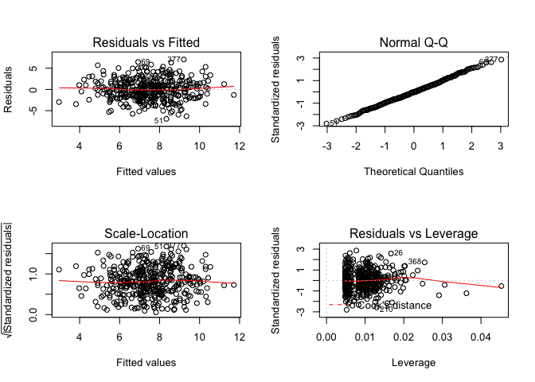

``` r
par(mfrow=c(1,1))
```

*b:* Coefficient interpretation

-   *β*<sub>0</sub> represents baseline sales and is significant at the 5% level
-   *β*<sub>1</sub> represent effect of price on sales and is significant at the 5% level. For every $100 increase in price, sales drop by 5400 units
-   *β*<sub>2</sub> represents effect of store location on sales. Urban store location contribute to a decrease of 22 units compared to a rural store location.
-   *β*<sub>3</sub> represents effect of country location on sales. Stores located in the US have increased sales of 1200 units compared to stores located outside the US.

*c:* Linear model fit above is:

*S**a**l**e**s* = 13.04 − 0.055 ⋅ *P**r**i**c**e* − 0.022 ⋅ *U**r**b**a**n* + 1.2 ⋅ *U**S* + *ϵ*

Coding:

-   `Urban` = 1 if store is in an urban location, 0 otherwise
-   `US` = 1 if store is located in the US, 0 otherwise

*d:* Null hypothesis of *H*<sub>0</sub> : *β*<sub>*j*</sub> = 0 can be rejected for *β*<sub>0</sub> (intercept), *β*<sub>1</sub> (Price) and *β*<sub>3</sub> (US) since their p-values are &lt; 0.05

*e* Smaller model

``` r
m <- lm(Sales ~ Price + US, data=Carseats)
summary(m)
```

    ## 
    ## Call:
    ## lm(formula = Sales ~ Price + US, data = Carseats)
    ## 
    ## Residuals:
    ##     Min      1Q  Median      3Q     Max 
    ## -6.9269 -1.6286 -0.0574  1.5766  7.0515 
    ## 
    ## Coefficients:
    ##             Estimate Std. Error t value Pr(>|t|)    
    ## (Intercept) 13.03079    0.63098  20.652  < 2e-16 ***
    ## Price       -0.05448    0.00523 -10.416  < 2e-16 ***
    ## USYes        1.19964    0.25846   4.641 4.71e-06 ***
    ## ---
    ## Signif. codes:  0 '***' 0.001 '**' 0.01 '*' 0.05 '.' 0.1 ' ' 1
    ## 
    ## Residual standard error: 2.469 on 397 degrees of freedom
    ## Multiple R-squared:  0.2393, Adjusted R-squared:  0.2354 
    ## F-statistic: 62.43 on 2 and 397 DF,  p-value: < 2.2e-16

``` r
par(mfrow=c(2,2))
plot(m)
```


``` r
par(mfrow=c(1,1))
```

*f:* Comparison of model fit:

-   Model 1: RSS = 2.472, ad R^2 = 0.2335
-   Model 2: RSS = 2.469, adj R^2 = 0.2354

Model fit is similar for both models.

*g:* Approx 95% CI for model coefficients in model 2:

``` r
 paste('intercept: (', round(coefficients(summary(m))[1,1] - 1.96*coefficients(summary(m))[1,2],3), ',', round(coefficients(summary(m))[1,1] + 1.96*coefficients(summary(m))[1,2],3), ')', sep='')
```

    ## [1] "intercept: (11.794,14.268)"

``` r
paste('Price: (', round(coefficients(summary(m))[2,1] - 1.96*coefficients(summary(m))[2,2],3), ',', round(coefficients(summary(m))[2,1] + 1.96*coefficients(summary(m))[2,2],3), ')', sep='')
```

    ## [1] "Price: (-0.065,-0.044)"

``` r
paste('US: (', round(coefficients(summary(m))[3,1] - 1.96*coefficients(summary(m))[3,2],3), ',', round(coefficients(summary(m))[3,1] + 1.96*coefficients(summary(m))[3,2],3), ')', sep='')
```

    ## [1] "US: (0.693,1.706)"

``` r
# 95% CI can also be calculated by:
confint(m)
```

    ##                   2.5 %      97.5 %
    ## (Intercept) 11.79032020 14.27126531
    ## Price       -0.06475984 -0.04419543
    ## USYes        0.69151957  1.70776632

*h:* Based on model diagnostics plots:

-   Outliers: Observations 51, 69, 377
-   High leverage observations: 1 obs seems to have high leverage

------------------------------------------------------------------------

### Exercise 11

Generate simulated data:

``` r
set.seed (1)
x <- rnorm(100)
y <- 2*x+rnorm(100)
```

*a:* Model without intercept

``` r
mxy <- lm(y ~ x - 1)
summary(mxy)
```

    ## 
    ## Call:
    ## lm(formula = y ~ x - 1)
    ## 
    ## Residuals:
    ##     Min      1Q  Median      3Q     Max 
    ## -1.9154 -0.6472 -0.1771  0.5056  2.3109 
    ## 
    ## Coefficients:
    ##   Estimate Std. Error t value Pr(>|t|)    
    ## x   1.9939     0.1065   18.73   <2e-16 ***
    ## ---
    ## Signif. codes:  0 '***' 0.001 '**' 0.01 '*' 0.05 '.' 0.1 ' ' 1
    ## 
    ## Residual standard error: 0.9586 on 99 degrees of freedom
    ## Multiple R-squared:  0.7798, Adjusted R-squared:  0.7776 
    ## F-statistic: 350.7 on 1 and 99 DF,  p-value: < 2.2e-16

``` r
coef(summary(mxy))
```

    ##   Estimate Std. Error  t value     Pr(>|t|)
    ## x 1.993876  0.1064767 18.72593 2.642197e-34

-   Coefficient for `x` is significant at the 5% level. Std error is small relative to estimate =&gt; 95% CI is narrow.

*b:* Model with intercept

``` r
myx <- lm(x ~ y -1)
summary(myx)
```

    ## 
    ## Call:
    ## lm(formula = x ~ y - 1)
    ## 
    ## Residuals:
    ##     Min      1Q  Median      3Q     Max 
    ## -0.8699 -0.2368  0.1030  0.2858  0.8938 
    ## 
    ## Coefficients:
    ##   Estimate Std. Error t value Pr(>|t|)    
    ## y  0.39111    0.02089   18.73   <2e-16 ***
    ## ---
    ## Signif. codes:  0 '***' 0.001 '**' 0.01 '*' 0.05 '.' 0.1 ' ' 1
    ## 
    ## Residual standard error: 0.4246 on 99 degrees of freedom
    ## Multiple R-squared:  0.7798, Adjusted R-squared:  0.7776 
    ## F-statistic: 350.7 on 1 and 99 DF,  p-value: < 2.2e-16

``` r
coef(summary(myx))
```

    ##    Estimate Std. Error  t value     Pr(>|t|)
    ## y 0.3911145 0.02088625 18.72593 2.642197e-34

-   Coefficient for `y` is significant at the 5% level. Std error is small relative to estimate =&gt; 95% CI is narrow.

*c:* *β* in `mxy` should be inverse of that in `myx` but this is only approximately true. Adj R^2 for both models is the same, but RSE for `mxy` is more than double that of `myx`.

*d:* TODO

*e:* `n` is the same in both models. The t-statistic shown above is symmetric in `x` and `y`, so it will be the same whether `x` is regressed onto `y` or vice versa.

*f:* T-statistic for *β*<sub>1</sub> is the same in both models below

``` r
mxy <- lm(x ~ y)
t1 <- coef(summary(mxy))[2,3]
t1
```

    ## [1] 18.5556

``` r
myx <- lm(y ~ x)
t2 <- coef(summary(myx))[2,3]
t2
```

    ## [1] 18.5556

``` r
 abs(t1-t2) < 1e6
```

    ## [1] TRUE

------------------------------------------------------------------------

### Exercise 12

*a:* Estimates for *β* for `Y ~ X` and `X ~ Y` are equal when denominators of (3.38) are equal (i.e., when `X = Y`)

*b:* Estimates for *β* in the 2 models below are different

``` r
set.seed(1) 
x <- rnorm(100)
y <- x + rnorm(100)

plot(x, y)
```

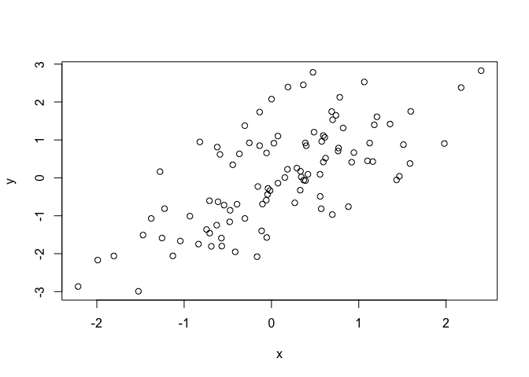

``` r
myx <- lm(y ~ x - 1)
summary(myx)
```

    ## 
    ## Call:
    ## lm(formula = y ~ x - 1)
    ## 
    ## Residuals:
    ##     Min      1Q  Median      3Q     Max 
    ## -1.9154 -0.6472 -0.1771  0.5056  2.3109 
    ## 
    ## Coefficients:
    ##   Estimate Std. Error t value Pr(>|t|)    
    ## x   0.9939     0.1065   9.334  3.1e-15 ***
    ## ---
    ## Signif. codes:  0 '***' 0.001 '**' 0.01 '*' 0.05 '.' 0.1 ' ' 1
    ## 
    ## Residual standard error: 0.9586 on 99 degrees of freedom
    ## Multiple R-squared:  0.4681, Adjusted R-squared:  0.4627 
    ## F-statistic: 87.13 on 1 and 99 DF,  p-value: 3.1e-15

``` r
mxy <- lm(x ~ y - 1)
summary(mxy)
```

    ## 
    ## Call:
    ## lm(formula = x ~ y - 1)
    ## 
    ## Residuals:
    ##      Min       1Q   Median       3Q      Max 
    ## -1.35410 -0.37468  0.09974  0.48799  1.55406 
    ## 
    ## Coefficients:
    ##   Estimate Std. Error t value Pr(>|t|)    
    ## y  0.47099    0.05046   9.334  3.1e-15 ***
    ## ---
    ## Signif. codes:  0 '***' 0.001 '**' 0.01 '*' 0.05 '.' 0.1 ' ' 1
    ## 
    ## Residual standard error: 0.6599 on 99 degrees of freedom
    ## Multiple R-squared:  0.4681, Adjusted R-squared:  0.4627 
    ## F-statistic: 87.13 on 1 and 99 DF,  p-value: 3.1e-15

*c:* Estimates for *β* in 2 models below are the same

``` r
set.seed(1) 
x <- rnorm(100)
y <- x

plot(x, y)
```

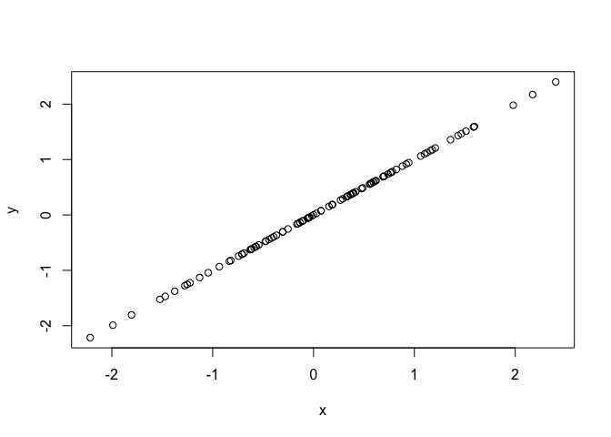

``` r
myx <- lm(y ~ x - 1)
summary(myx)
```

    ## Warning in summary.lm(myx): essentially perfect fit: summary may be
    ## unreliable

    ## 
    ## Call:
    ## lm(formula = y ~ x - 1)
    ## 
    ## Residuals:
    ##        Min         1Q     Median         3Q        Max 
    ## -1.888e-16 -1.689e-17  1.339e-18  3.057e-17  2.552e-16 
    ## 
    ## Coefficients:
    ##    Estimate Std. Error   t value Pr(>|t|)    
    ## x 1.000e+00  6.479e-18 1.543e+17   <2e-16 ***
    ## ---
    ## Signif. codes:  0 '***' 0.001 '**' 0.01 '*' 0.05 '.' 0.1 ' ' 1
    ## 
    ## Residual standard error: 5.833e-17 on 99 degrees of freedom
    ## Multiple R-squared:      1,  Adjusted R-squared:      1 
    ## F-statistic: 2.382e+34 on 1 and 99 DF,  p-value: < 2.2e-16

``` r
mxy <- lm(x ~ y - 1)
summary(mxy)
```

    ## Warning in summary.lm(mxy): essentially perfect fit: summary may be
    ## unreliable

    ## 
    ## Call:
    ## lm(formula = x ~ y - 1)
    ## 
    ## Residuals:
    ##        Min         1Q     Median         3Q        Max 
    ## -1.888e-16 -1.689e-17  1.339e-18  3.057e-17  2.552e-16 
    ## 
    ## Coefficients:
    ##    Estimate Std. Error   t value Pr(>|t|)    
    ## y 1.000e+00  6.479e-18 1.543e+17   <2e-16 ***
    ## ---
    ## Signif. codes:  0 '***' 0.001 '**' 0.01 '*' 0.05 '.' 0.1 ' ' 1
    ## 
    ## Residual standard error: 5.833e-17 on 99 degrees of freedom
    ## Multiple R-squared:      1,  Adjusted R-squared:      1 
    ## F-statistic: 2.382e+34 on 1 and 99 DF,  p-value: < 2.2e-16

------------------------------------------------------------------------

### Exercise 13

*a:*

``` r
x <- rnorm(100)
```

*b:*

``` r
eps <- rnorm(100, 0, sd=sqrt(0.25))
```

*c:*

``` r
y <- -1 + 0.5*x + eps
```

-   Length of `y` is 100
-   *β*<sub>0</sub> = −1, *β*<sub>1</sub> = 0.5

*d:* As expected, `y` is randomly distributed around `0.5 x`

``` r
plot(x, y)
```

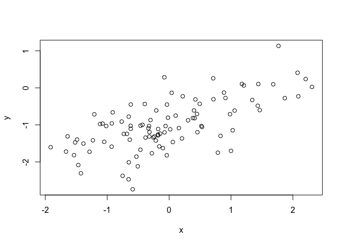

``` r
cor(x, y)
```

    ## [1] 0.659647

*e:*

``` r
m <- lm(y ~ x)
summary(m)
```

    ## 
    ## Call:
    ## lm(formula = y ~ x)
    ## 
    ## Residuals:
    ##      Min       1Q   Median       3Q      Max 
    ## -1.47403 -0.23074  0.00645  0.32510  1.30869 
    ## 
    ## Coefficients:
    ##             Estimate Std. Error t value Pr(>|t|)    
    ## (Intercept) -0.98617    0.05195 -18.982  < 2e-16 ***
    ## x            0.47326    0.05447   8.689 8.43e-14 ***
    ## ---
    ## Signif. codes:  0 '***' 0.001 '**' 0.01 '*' 0.05 '.' 0.1 ' ' 1
    ## 
    ## Residual standard error: 0.5191 on 98 degrees of freedom
    ## Multiple R-squared:  0.4351, Adjusted R-squared:  0.4294 
    ## F-statistic: 75.49 on 1 and 98 DF,  p-value: 8.429e-14

Estimates of *β*<sub>0</sub> and *β*<sub>1</sub> are close to their true values. Std errors for these estimates are small. And both coefficients are statistically significant at the 5% level.

*f:*

``` r
plot(x,y)
abline(m, col='red', lwd=2)

df <- data.frame(x, y)
df <- df[order(df[,1]),]
lines(df$x, -1 + 0.5*df$x, col='blue', lwd=2, lty='dotted')
legend("bottomright", legend=c('linear model', 'pop. regr. line'), col=c('red', 'blue'), lwd=2)
```

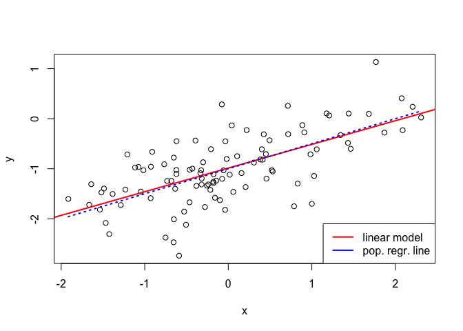

*g:*

``` r
m1 <- lm(y ~ x + I(x^2))
summary(m1)
```

    ## 
    ## Call:
    ## lm(formula = y ~ x + I(x^2))
    ## 
    ## Residuals:
    ##      Min       1Q   Median       3Q      Max 
    ## -1.44942 -0.26882  0.02068  0.30745  1.36804 
    ## 
    ## Coefficients:
    ##             Estimate Std. Error t value Pr(>|t|)    
    ## (Intercept) -1.04772    0.06673 -15.702  < 2e-16 ***
    ## x            0.44980    0.05650   7.961 3.24e-12 ***
    ## I(x^2)       0.06668    0.04575   1.457    0.148    
    ## ---
    ## Signif. codes:  0 '***' 0.001 '**' 0.01 '*' 0.05 '.' 0.1 ' ' 1
    ## 
    ## Residual standard error: 0.5162 on 97 degrees of freedom
    ## Multiple R-squared:  0.4472, Adjusted R-squared:  0.4358 
    ## F-statistic: 39.24 on 2 and 97 DF,  p-value: 3.26e-13

``` r
anova(m, m1)
```

    ## Analysis of Variance Table
    ## 
    ## Model 1: y ~ x
    ## Model 2: y ~ x + I(x^2)
    ##   Res.Df    RSS Df Sum of Sq      F Pr(>F)
    ## 1     98 26.410                           
    ## 2     97 25.844  1   0.56581 2.1236 0.1483

In this model, the coefficient for *x*<sup>2</sup> is not significant at the 5% level. `RSE` and Adjusted *R*<sup>2</sup> are similar for both models. ANOVA of both models suggests that *x*<sup>2</sup> does not significant decrease RSS. So *x*<sup>2</sup> has no impact on the model.

*h:*

``` r
eps <- rnorm(100, 0, sd=sqrt(0.1))
y <- -1 + 0.5*x + eps

m2 <- lm(y ~ x)
summary(m2)
```

    ## 
    ## Call:
    ## lm(formula = y ~ x)
    ## 
    ## Residuals:
    ##      Min       1Q   Median       3Q      Max 
    ## -0.82723 -0.17712 -0.01984  0.20496  0.59037 
    ## 
    ## Coefficients:
    ##             Estimate Std. Error t value Pr(>|t|)    
    ## (Intercept) -0.98441    0.03149  -31.26   <2e-16 ***
    ## x            0.48087    0.03301   14.57   <2e-16 ***
    ## ---
    ## Signif. codes:  0 '***' 0.001 '**' 0.01 '*' 0.05 '.' 0.1 ' ' 1
    ## 
    ## Residual standard error: 0.3147 on 98 degrees of freedom
    ## Multiple R-squared:  0.684,  Adjusted R-squared:  0.6808 
    ## F-statistic: 212.2 on 1 and 98 DF,  p-value: < 2.2e-16

``` r
plot(x, y, main="Less Noise")
abline(m2, col='red', lwd=2)

df <- data.frame(x, y)
df <- df[order(df[,1]),]
lines(df$x, -1 + 0.5*df$x, col='blue', lwd=2, lty='dotted')
legend("bottomright", legend=c('linear model', 'pop. regr. line'), col=c('red', 'blue'), lwd=2)
```

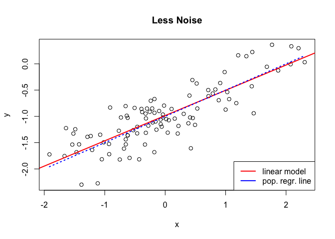

Estimate of *β*<sub>1</sub> is similar to, and `RSE` and adjusted *R*<sup>2</sup> are lower than, the first model due to lower variance in the data

*i:*

``` r
eps <- rnorm(100, 0, sd=sqrt(0.75))
y <- -1 + 0.5*x + eps

m3 <- lm(y ~ x)
summary(m3)
```

    ## 
    ## Call:
    ## lm(formula = y ~ x)
    ## 
    ## Residuals:
    ##     Min      1Q  Median      3Q     Max 
    ## -2.4692 -0.6357 -0.0745  0.5989  3.5010 
    ## 
    ## Coefficients:
    ##             Estimate Std. Error t value Pr(>|t|)    
    ## (Intercept)  -1.0285     0.1010 -10.188  < 2e-16 ***
    ## x             0.6430     0.1058   6.075 2.37e-08 ***
    ## ---
    ## Signif. codes:  0 '***' 0.001 '**' 0.01 '*' 0.05 '.' 0.1 ' ' 1
    ## 
    ## Residual standard error: 1.009 on 98 degrees of freedom
    ## Multiple R-squared:  0.2736, Adjusted R-squared:  0.2661 
    ## F-statistic:  36.9 on 1 and 98 DF,  p-value: 2.369e-08

``` r
plot(x, y, main="More Noise")
abline(m3, col='red', lwd=2)

df <- data.frame(x, y)
df <- df[order(df[,1]),]
lines(df$x, -1 + 0.5*df$x, col='blue', lwd=2, lty='dotted')
legend("bottomright", legend=c('linear model', 'pop. regr. line'), col=c('red', 'blue'), lwd=2)
```

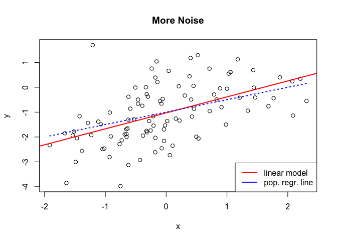

Estimate of *β*<sub>1</sub> is worse than, and `RSE` & adjusted *R*<sup>2</sup> are higher than, the first model due to higher variance in the data.

*j:* Std errors of model coefficient estimates increase with the variance in the data and so the corresponding confidence intervals also increase with data variance.

``` r
confint(m)
```

    ##                  2.5 %     97.5 %
    ## (Intercept) -1.0892743 -0.8830744
    ## x            0.3651659  0.5813476

``` r
confint(m2)
```

    ##                  2.5 %     97.5 %
    ## (Intercept) -1.0468961 -0.9219143
    ## x            0.4153574  0.5463893

``` r
confint(m3)
```

    ##                  2.5 %     97.5 %
    ## (Intercept) -1.2288214 -0.8281512
    ## x            0.4329245  0.8529904

------------------------------------------------------------------------

### Exercise 14

*a:* Linear model is:

``` r
set.seed(1)
x1 = runif(100)
x2 = 0.5*x1 + rnorm(100)/10
y = 2 + 2*x1 + 0.3*x2 + rnorm(100)
```

*β*<sub>0</sub> + *β*<sub>1</sub>*x*<sub>1</sub> + *β*<sub>2</sub>*x*2 + *ϵ*, where regression coefficients are:

*β*<sub>0</sub> = 2 *β*<sub>1</sub> = 2 *β*<sub>2</sub> = 0.3

*b:* Correlation between `x1` and `x2` is:

``` r
cor(x1, x2)
```

    ## [1] 0.8351212

``` r
plot(x1, x2, pch=16)
lines(lowess(x1, x2), col='red', lwd=2)
```

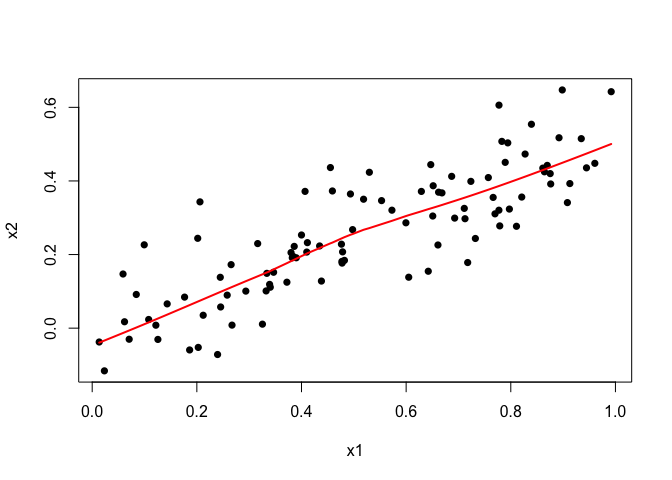

*c:* Linear model with both `x1` and `x2`

``` r
m <- lm(y ~ x1 + x2)
summary(m)
```

    ## 
    ## Call:
    ## lm(formula = y ~ x1 + x2)
    ## 
    ## Residuals:
    ##     Min      1Q  Median      3Q     Max 
    ## -2.8311 -0.7273 -0.0537  0.6338  2.3359 
    ## 
    ## Coefficients:
    ##             Estimate Std. Error t value Pr(>|t|)    
    ## (Intercept)   2.1305     0.2319   9.188 7.61e-15 ***
    ## x1            1.4396     0.7212   1.996   0.0487 *  
    ## x2            1.0097     1.1337   0.891   0.3754    
    ## ---
    ## Signif. codes:  0 '***' 0.001 '**' 0.01 '*' 0.05 '.' 0.1 ' ' 1
    ## 
    ## Residual standard error: 1.056 on 97 degrees of freedom
    ## Multiple R-squared:  0.2088, Adjusted R-squared:  0.1925 
    ## F-statistic:  12.8 on 2 and 97 DF,  p-value: 1.164e-05

-   Estimate for *β*<sub>0</sub> is closer to true value but estimates of *β*<sub>1</sub> and *β*<sub>2</sub> are very different (though the std error includes the true value)
-   Cannot reject hypothesis: *H*<sub>0</sub> : *β*<sub>1</sub> = 0
-   Can reject hypothesis: *H*<sub>0</sub> : *β*<sub>2</sub> = 0

*d:* Linear model with `x1` only

``` r
m <- lm(y ~ x1)
summary(m)
```

    ## 
    ## Call:
    ## lm(formula = y ~ x1)
    ## 
    ## Residuals:
    ##      Min       1Q   Median       3Q      Max 
    ## -2.89495 -0.66874 -0.07785  0.59221  2.45560 
    ## 
    ## Coefficients:
    ##             Estimate Std. Error t value Pr(>|t|)    
    ## (Intercept)   2.1124     0.2307   9.155 8.27e-15 ***
    ## x1            1.9759     0.3963   4.986 2.66e-06 ***
    ## ---
    ## Signif. codes:  0 '***' 0.001 '**' 0.01 '*' 0.05 '.' 0.1 ' ' 1
    ## 
    ## Residual standard error: 1.055 on 98 degrees of freedom
    ## Multiple R-squared:  0.2024, Adjusted R-squared:  0.1942 
    ## F-statistic: 24.86 on 1 and 98 DF,  p-value: 2.661e-06

-   Estimates of model coefficients are 'close' to their true values
-   Estimates for both *β*<sub>0</sub> and *β*<sub>1</sub> are significant at the 5% level (p-value &lt; 0.05)

*e:* Linear model with `x2` only

``` r
m <- lm(y ~ x2)
summary(m)
```

    ## 
    ## Call:
    ## lm(formula = y ~ x2)
    ## 
    ## Residuals:
    ##      Min       1Q   Median       3Q      Max 
    ## -2.62687 -0.75156 -0.03598  0.72383  2.44890 
    ## 
    ## Coefficients:
    ##             Estimate Std. Error t value Pr(>|t|)    
    ## (Intercept)   2.3899     0.1949   12.26  < 2e-16 ***
    ## x2            2.8996     0.6330    4.58 1.37e-05 ***
    ## ---
    ## Signif. codes:  0 '***' 0.001 '**' 0.01 '*' 0.05 '.' 0.1 ' ' 1
    ## 
    ## Residual standard error: 1.072 on 98 degrees of freedom
    ## Multiple R-squared:  0.1763, Adjusted R-squared:  0.1679 
    ## F-statistic: 20.98 on 1 and 98 DF,  p-value: 1.366e-05

-   Estimate of *β*<sub>0</sub> is close to its true value and is significant at the 5% level
-   Estimate of *β*<sub>1</sub> is far from its true value but is significant at the 5% level

*f:* Yes, the estimates of model coefficients and their statistical significance from `(c) - (e)` contradict each other. *β*<sub>1</sub> and *β*<sub>2</sub> are significant when covariates are included individually, but only *β*<sub>2</sub> is significant when both covariates are included in the model. This is because `x1` and `x2` are highly correlated. This correlation also results ininflated std errors for *β*<sub>1</sub> and *β*<sub>2</sub> when both are included in the model. Std errors are almost double that of std errors for the same coefficients in models containing a single coefficient.

*g:* Include additional point

``` r
x1 = c(x1, 0.1)
x2 = c(x2, 0.8)
y = c(y,6)

m1 <- lm(y ~ x1)
m2 <- lm(y ~ x2)
m12 <- lm(y ~ x1 + x2)

par(mfrow=c(2,2))

plot(x1, y)
lines(lowess(x1, y), col='red', lwd=2)
abline(m1, col='blue', lwd=2)
legend("bottomright", legend=c('lowess', 'model'), col=c('red', 'blue'), lwd=2)
points(0.1, 6, pch=16, cex=1.5)

plot(x2, y)
lines(lowess(x2, y), col='red', lwd=2)
abline(m2, col='blue', lwd=2)
legend("bottomright", legend=c('lowess', 'model'), col=c('red', 'blue'), lwd=2)
points(0.8, 6, pch=16, cex=1.5)

plot(x1, x2)
lines(lowess(x1, x2), col='red', lwd=2)
points(0.1, 0.8, pch=16, cex=1.5)

plot(y)
points(101, 6, pch=16, cex=1.5)
```

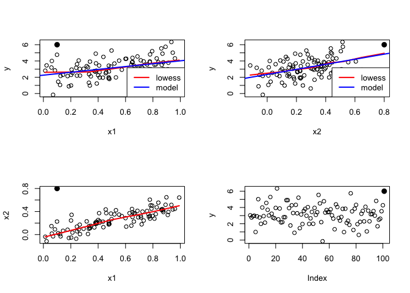

``` r
summary(m1)
```

    ## 
    ## Call:
    ## lm(formula = y ~ x1)
    ## 
    ## Residuals:
    ##     Min      1Q  Median      3Q     Max 
    ## -2.8897 -0.6556 -0.0909  0.5682  3.5665 
    ## 
    ## Coefficients:
    ##             Estimate Std. Error t value Pr(>|t|)    
    ## (Intercept)   2.2569     0.2390   9.445 1.78e-15 ***
    ## x1            1.7657     0.4124   4.282 4.29e-05 ***
    ## ---
    ## Signif. codes:  0 '***' 0.001 '**' 0.01 '*' 0.05 '.' 0.1 ' ' 1
    ## 
    ## Residual standard error: 1.111 on 99 degrees of freedom
    ## Multiple R-squared:  0.1562, Adjusted R-squared:  0.1477 
    ## F-statistic: 18.33 on 1 and 99 DF,  p-value: 4.295e-05

``` r
plot(m1)
```

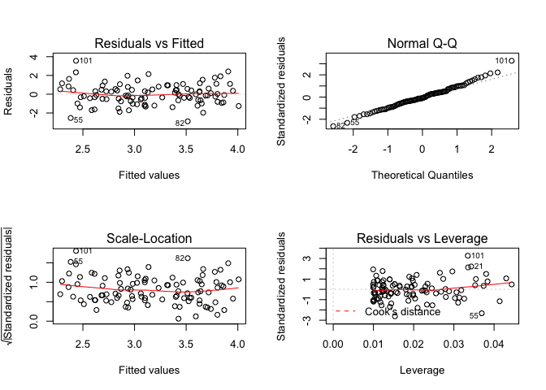

``` r
summary(m2)
```

    ## 
    ## Call:
    ## lm(formula = y ~ x2)
    ## 
    ## Residuals:
    ##      Min       1Q   Median       3Q      Max 
    ## -2.64729 -0.71021 -0.06899  0.72699  2.38074 
    ## 
    ## Coefficients:
    ##             Estimate Std. Error t value Pr(>|t|)    
    ## (Intercept)   2.3451     0.1912  12.264  < 2e-16 ***
    ## x2            3.1190     0.6040   5.164 1.25e-06 ***
    ## ---
    ## Signif. codes:  0 '***' 0.001 '**' 0.01 '*' 0.05 '.' 0.1 ' ' 1
    ## 
    ## Residual standard error: 1.074 on 99 degrees of freedom
    ## Multiple R-squared:  0.2122, Adjusted R-squared:  0.2042 
    ## F-statistic: 26.66 on 1 and 99 DF,  p-value: 1.253e-06

``` r
plot(m2)
```

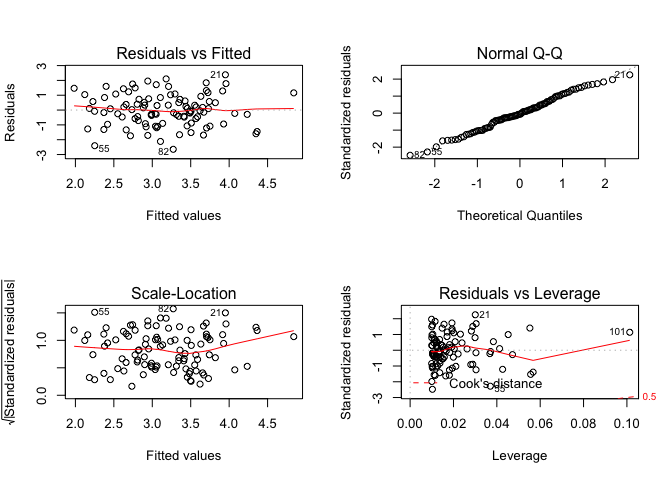

``` r
summary(m12)
```

    ## 
    ## Call:
    ## lm(formula = y ~ x1 + x2)
    ## 
    ## Residuals:
    ##      Min       1Q   Median       3Q      Max 
    ## -2.73348 -0.69318 -0.05263  0.66385  2.30619 
    ## 
    ## Coefficients:
    ##             Estimate Std. Error t value Pr(>|t|)    
    ## (Intercept)   2.2267     0.2314   9.624 7.91e-16 ***
    ## x1            0.5394     0.5922   0.911  0.36458    
    ## x2            2.5146     0.8977   2.801  0.00614 ** 
    ## ---
    ## Signif. codes:  0 '***' 0.001 '**' 0.01 '*' 0.05 '.' 0.1 ' ' 1
    ## 
    ## Residual standard error: 1.075 on 98 degrees of freedom
    ## Multiple R-squared:  0.2188, Adjusted R-squared:  0.2029 
    ## F-statistic: 13.72 on 2 and 98 DF,  p-value: 5.564e-06

``` r
plot(m12)
```

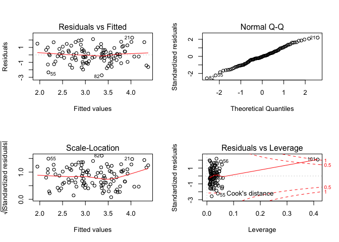

-   In model with both covariates, only coefficient for `x2` is significant at the 5% level. Both coefficients are far from their true values.
-   In model with only `x1`, coefficient for `x1` is significant at the 5% level but its estimate is far from its true value (though within std error)
-   In model with only `x2`, coefficient for `x2` is significant at the 5% level but its estimate is far from true value
-   The new point is an outlier in the model containing only `x1` but not in the other 2 models.
-   The new point is a high leverage point in all 3 models.

------------------------------------------------------------------------

### Exercise 15

*a:* Simple linear regression of`crim` vs. each covariate.

When fitting a linear model of `crim` against each of the covariates separately, all covariates have a significant relationship with `crim` (p-value &lt; 0.05 for model coefficient term for covariate). The plots below show how `crim` changes with each covariate.

``` r
library(MASS)
data(Boston)

m1.coef <- vector(mode="numeric", length=length(names(Boston)) - 1)

for (i in 2:length(Boston)) {
  plot(Boston[,1] ~ Boston[,i], xlab=names(Boston)[i], ylab=names(Boston)[1])
  
  m <- lm(Boston[,1] ~ Boston[,i])
  
  cf = names(Boston)[i]
  cfsum = summary(m)$coefficients
  
  m1.coef[i-1] <- cfsum[2,1]
  ifelse(cfsum[2,4] < 0.05, print(paste(cf, ': Model coef is significant')), print(paste(cf, ': NO')) )
}
```

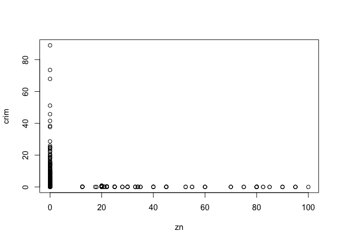

    ## [1] "zn : Model coef is significant"


    ## [1] "indus : Model coef is significant"


    ## [1] "chas : NO"


    ## [1] "nox : Model coef is significant"

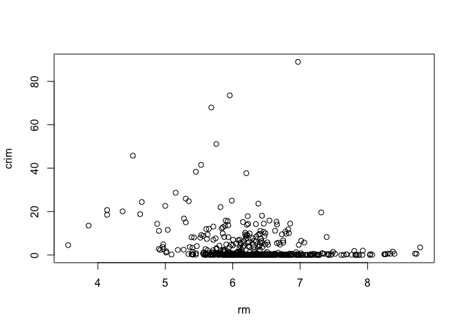

    ## [1] "rm : Model coef is significant"

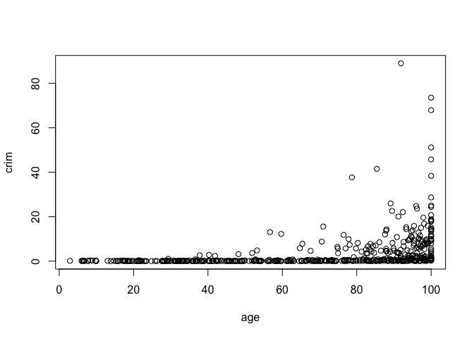

    ## [1] "age : Model coef is significant"


    ## [1] "dis : Model coef is significant"

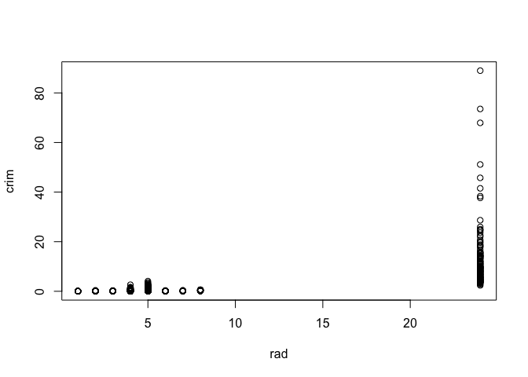

    ## [1] "rad : Model coef is significant"


    ## [1] "tax : Model coef is significant"

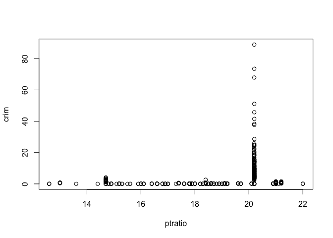

    ## [1] "ptratio : Model coef is significant"

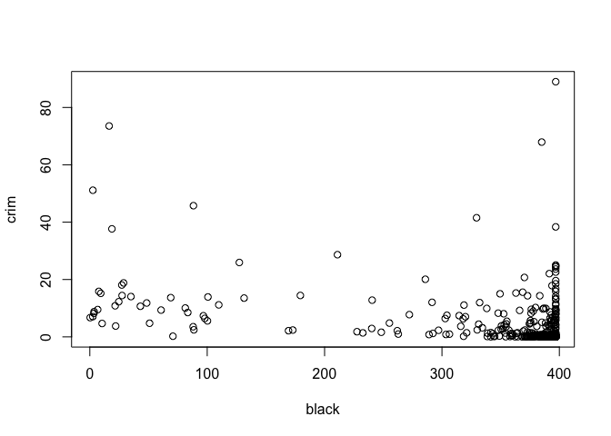

    ## [1] "black : Model coef is significant"


    ## [1] "lstat : Model coef is significant"


    ## [1] "medv : Model coef is significant"

*b:* Multiple linear regression of `crim` vs. all covariates.

From the model summary, only the covariates below are statistically significant, so we can reject the null hypothesis `H_0: B_j = 0`

-   `zn`
-   `dis`
-   `rad`
-   `black`
-   `medv`

``` r
m2 <- lm(crim ~ .-crim, data=Boston)
summary(m2)
```

    ## 
    ## Call:
    ## lm(formula = crim ~ . - crim, data = Boston)
    ## 
    ## Residuals:
    ##    Min     1Q Median     3Q    Max 
    ## -9.924 -2.120 -0.353  1.019 75.051 
    ## 
    ## Coefficients:
    ##               Estimate Std. Error t value Pr(>|t|)    
    ## (Intercept)  17.033228   7.234903   2.354 0.018949 *  
    ## zn            0.044855   0.018734   2.394 0.017025 *  
    ## indus        -0.063855   0.083407  -0.766 0.444294    
    ## chas         -0.749134   1.180147  -0.635 0.525867    
    ## nox         -10.313535   5.275536  -1.955 0.051152 .  
    ## rm            0.430131   0.612830   0.702 0.483089    
    ## age           0.001452   0.017925   0.081 0.935488    
    ## dis          -0.987176   0.281817  -3.503 0.000502 ***
    ## rad           0.588209   0.088049   6.680 6.46e-11 ***
    ## tax          -0.003780   0.005156  -0.733 0.463793    
    ## ptratio      -0.271081   0.186450  -1.454 0.146611    
    ## black        -0.007538   0.003673  -2.052 0.040702 *  
    ## lstat         0.126211   0.075725   1.667 0.096208 .  
    ## medv         -0.198887   0.060516  -3.287 0.001087 ** 
    ## ---
    ## Signif. codes:  0 '***' 0.001 '**' 0.01 '*' 0.05 '.' 0.1 ' ' 1
    ## 
    ## Residual standard error: 6.439 on 492 degrees of freedom
    ## Multiple R-squared:  0.454,  Adjusted R-squared:  0.4396 
    ## F-statistic: 31.47 on 13 and 492 DF,  p-value: < 2.2e-16

``` r
m2.coef = coef(m2)[-1]
m2.coef
```

    ##            zn         indus          chas           nox            rm 
    ##   0.044855215  -0.063854824  -0.749133611 -10.313534912   0.430130506 
    ##           age           dis           rad           tax       ptratio 
    ##   0.001451643  -0.987175726   0.588208591  -0.003780016  -0.271080558 
    ##         black         lstat          medv 
    ##  -0.007537505   0.126211376  -0.198886821

*c:* More covariates are statistically significant when `crim` is regressed against each of them separately. Coefficient for `nox` is very different between the 2 models. Even the signs of the coefficients do not match. Coefficients for other covariates are more similar in comparison.

``` r
df <- cbind(m1.coef, m2.coef)
plot(df, main='Model Coefficient comparison', xlab='Simple Linear Regression', ylab='Multiple Linear Regression')
```

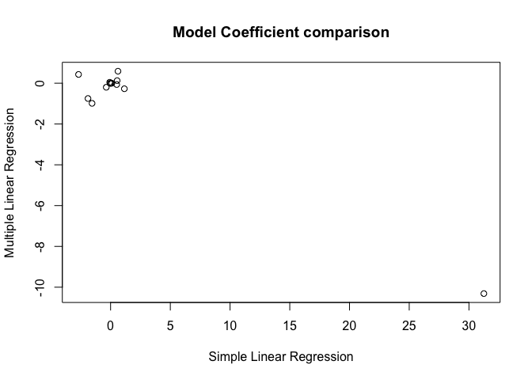

``` r
plot(df, main='Model Coefficient comparison (zoom)', xlab='Simple Linear Regression', ylab='Multiple Linear Regression', xlim=c(-3,3), ylim=c(-1.1,1.1), pch=16)
```


*d:* Investigate non-linear association between response & covariates

The pairwise plots of response vs. covariates show the relationship between the 2. The covariates below show evidence of non-linear relationship wth the response `crim`.

-   indus
-   nox
-   age
-   dis
-   ptratio
-   medv

``` r
plot(Boston)
```


``` r
for (i in 2:ncol(Boston)) {
  covar <- names(Boston)[i]
  f <- paste(names(Boston)[1], ' ~ ', covar, '+ I(', covar, '^2) + I(', covar, '^3)', sep='')
  m <- lm(as.formula(f), data=Boston)
  print(summary(m))
  print('-----')
}
```

    ## 
    ## Call:
    ## lm(formula = as.formula(f), data = Boston)
    ## 
    ## Residuals:
    ##    Min     1Q Median     3Q    Max 
    ## -4.821 -4.614 -1.294  0.473 84.130 
    ## 
    ## Coefficients:
    ##               Estimate Std. Error t value Pr(>|t|)    
    ## (Intercept)  4.846e+00  4.330e-01  11.192  < 2e-16 ***
    ## zn          -3.322e-01  1.098e-01  -3.025  0.00261 ** 
    ## I(zn^2)      6.483e-03  3.861e-03   1.679  0.09375 .  
    ## I(zn^3)     -3.776e-05  3.139e-05  -1.203  0.22954    
    ## ---
    ## Signif. codes:  0 '***' 0.001 '**' 0.01 '*' 0.05 '.' 0.1 ' ' 1
    ## 
    ## Residual standard error: 8.372 on 502 degrees of freedom
    ## Multiple R-squared:  0.05824,    Adjusted R-squared:  0.05261 
    ## F-statistic: 10.35 on 3 and 502 DF,  p-value: 1.281e-06
    ## 
    ## [1] "-----"
    ## 
    ## Call:
    ## lm(formula = as.formula(f), data = Boston)
    ## 
    ## Residuals:
    ##    Min     1Q Median     3Q    Max 
    ## -8.278 -2.514  0.054  0.764 79.713 
    ## 
    ## Coefficients:
    ##               Estimate Std. Error t value Pr(>|t|)    
    ## (Intercept)  3.6625683  1.5739833   2.327   0.0204 *  
    ## indus       -1.9652129  0.4819901  -4.077 5.30e-05 ***
    ## I(indus^2)   0.2519373  0.0393221   6.407 3.42e-10 ***
    ## I(indus^3)  -0.0069760  0.0009567  -7.292 1.20e-12 ***
    ## ---
    ## Signif. codes:  0 '***' 0.001 '**' 0.01 '*' 0.05 '.' 0.1 ' ' 1
    ## 
    ## Residual standard error: 7.423 on 502 degrees of freedom
    ## Multiple R-squared:  0.2597, Adjusted R-squared:  0.2552 
    ## F-statistic: 58.69 on 3 and 502 DF,  p-value: < 2.2e-16
    ## 
    ## [1] "-----"
    ## 
    ## Call:
    ## lm(formula = as.formula(f), data = Boston)
    ## 
    ## Residuals:
    ##    Min     1Q Median     3Q    Max 
    ## -3.738 -3.661 -3.435  0.018 85.232 
    ## 
    ## Coefficients: (2 not defined because of singularities)
    ##             Estimate Std. Error t value Pr(>|t|)    
    ## (Intercept)   3.7444     0.3961   9.453   <2e-16 ***
    ## chas         -1.8928     1.5061  -1.257    0.209    
    ## I(chas^2)         NA         NA      NA       NA    
    ## I(chas^3)         NA         NA      NA       NA    
    ## ---
    ## Signif. codes:  0 '***' 0.001 '**' 0.01 '*' 0.05 '.' 0.1 ' ' 1
    ## 
    ## Residual standard error: 8.597 on 504 degrees of freedom
    ## Multiple R-squared:  0.003124,   Adjusted R-squared:  0.001146 
    ## F-statistic: 1.579 on 1 and 504 DF,  p-value: 0.2094
    ## 
    ## [1] "-----"
    ## 
    ## Call:
    ## lm(formula = as.formula(f), data = Boston)
    ## 
    ## Residuals:
    ##    Min     1Q Median     3Q    Max 
    ## -9.110 -2.068 -0.255  0.739 78.302 
    ## 
    ## Coefficients:
    ##             Estimate Std. Error t value Pr(>|t|)    
    ## (Intercept)   233.09      33.64   6.928 1.31e-11 ***
    ## nox         -1279.37     170.40  -7.508 2.76e-13 ***
    ## I(nox^2)     2248.54     279.90   8.033 6.81e-15 ***
    ## I(nox^3)    -1245.70     149.28  -8.345 6.96e-16 ***
    ## ---
    ## Signif. codes:  0 '***' 0.001 '**' 0.01 '*' 0.05 '.' 0.1 ' ' 1
    ## 
    ## Residual standard error: 7.234 on 502 degrees of freedom
    ## Multiple R-squared:  0.297,  Adjusted R-squared:  0.2928 
    ## F-statistic: 70.69 on 3 and 502 DF,  p-value: < 2.2e-16
    ## 
    ## [1] "-----"
    ## 
    ## Call:
    ## lm(formula = as.formula(f), data = Boston)
    ## 
    ## Residuals:
    ##     Min      1Q  Median      3Q     Max 
    ## -18.485  -3.468  -2.221  -0.015  87.219 
    ## 
    ## Coefficients:
    ##             Estimate Std. Error t value Pr(>|t|)  
    ## (Intercept) 112.6246    64.5172   1.746   0.0815 .
    ## rm          -39.1501    31.3115  -1.250   0.2118  
    ## I(rm^2)       4.5509     5.0099   0.908   0.3641  
    ## I(rm^3)      -0.1745     0.2637  -0.662   0.5086  
    ## ---
    ## Signif. codes:  0 '***' 0.001 '**' 0.01 '*' 0.05 '.' 0.1 ' ' 1
    ## 
    ## Residual standard error: 8.33 on 502 degrees of freedom
    ## Multiple R-squared:  0.06779,    Adjusted R-squared:  0.06222 
    ## F-statistic: 12.17 on 3 and 502 DF,  p-value: 1.067e-07
    ## 
    ## [1] "-----"
    ## 
    ## Call:
    ## lm(formula = as.formula(f), data = Boston)
    ## 
    ## Residuals:
    ##    Min     1Q Median     3Q    Max 
    ## -9.762 -2.673 -0.516  0.019 82.842 
    ## 
    ## Coefficients:
    ##               Estimate Std. Error t value Pr(>|t|)   
    ## (Intercept) -2.549e+00  2.769e+00  -0.920  0.35780   
    ## age          2.737e-01  1.864e-01   1.468  0.14266   
    ## I(age^2)    -7.230e-03  3.637e-03  -1.988  0.04738 * 
    ## I(age^3)     5.745e-05  2.109e-05   2.724  0.00668 **
    ## ---
    ## Signif. codes:  0 '***' 0.001 '**' 0.01 '*' 0.05 '.' 0.1 ' ' 1
    ## 
    ## Residual standard error: 7.84 on 502 degrees of freedom
    ## Multiple R-squared:  0.1742, Adjusted R-squared:  0.1693 
    ## F-statistic: 35.31 on 3 and 502 DF,  p-value: < 2.2e-16
    ## 
    ## [1] "-----"
    ## 
    ## Call:
    ## lm(formula = as.formula(f), data = Boston)
    ## 
    ## Residuals:
    ##     Min      1Q  Median      3Q     Max 
    ## -10.757  -2.588   0.031   1.267  76.378 
    ## 
    ## Coefficients:
    ##             Estimate Std. Error t value Pr(>|t|)    
    ## (Intercept)  30.0476     2.4459  12.285  < 2e-16 ***
    ## dis         -15.5543     1.7360  -8.960  < 2e-16 ***
    ## I(dis^2)      2.4521     0.3464   7.078 4.94e-12 ***
    ## I(dis^3)     -0.1186     0.0204  -5.814 1.09e-08 ***
    ## ---
    ## Signif. codes:  0 '***' 0.001 '**' 0.01 '*' 0.05 '.' 0.1 ' ' 1
    ## 
    ## Residual standard error: 7.331 on 502 degrees of freedom
    ## Multiple R-squared:  0.2778, Adjusted R-squared:  0.2735 
    ## F-statistic: 64.37 on 3 and 502 DF,  p-value: < 2.2e-16
    ## 
    ## [1] "-----"
    ## 
    ## Call:
    ## lm(formula = as.formula(f), data = Boston)
    ## 
    ## Residuals:
    ##     Min      1Q  Median      3Q     Max 
    ## -10.381  -0.412  -0.269   0.179  76.217 
    ## 
    ## Coefficients:
    ##              Estimate Std. Error t value Pr(>|t|)
    ## (Intercept) -0.605545   2.050108  -0.295    0.768
    ## rad          0.512736   1.043597   0.491    0.623
    ## I(rad^2)    -0.075177   0.148543  -0.506    0.613
    ## I(rad^3)     0.003209   0.004564   0.703    0.482
    ## 
    ## Residual standard error: 6.682 on 502 degrees of freedom
    ## Multiple R-squared:    0.4,  Adjusted R-squared:  0.3965 
    ## F-statistic: 111.6 on 3 and 502 DF,  p-value: < 2.2e-16
    ## 
    ## [1] "-----"
    ## 
    ## Call:
    ## lm(formula = as.formula(f), data = Boston)
    ## 
    ## Residuals:
    ##     Min      1Q  Median      3Q     Max 
    ## -13.273  -1.389   0.046   0.536  76.950 
    ## 
    ## Coefficients:
    ##               Estimate Std. Error t value Pr(>|t|)
    ## (Intercept)  1.918e+01  1.180e+01   1.626    0.105
    ## tax         -1.533e-01  9.568e-02  -1.602    0.110
    ## I(tax^2)     3.608e-04  2.425e-04   1.488    0.137
    ## I(tax^3)    -2.204e-07  1.889e-07  -1.167    0.244
    ## 
    ## Residual standard error: 6.854 on 502 degrees of freedom
    ## Multiple R-squared:  0.3689, Adjusted R-squared:  0.3651 
    ## F-statistic:  97.8 on 3 and 502 DF,  p-value: < 2.2e-16
    ## 
    ## [1] "-----"
    ## 
    ## Call:
    ## lm(formula = as.formula(f), data = Boston)
    ## 
    ## Residuals:
    ##    Min     1Q Median     3Q    Max 
    ## -6.833 -4.146 -1.655  1.408 82.697 
    ## 
    ## Coefficients:
    ##               Estimate Std. Error t value Pr(>|t|)   
    ## (Intercept)  477.18405  156.79498   3.043  0.00246 **
    ## ptratio      -82.36054   27.64394  -2.979  0.00303 **
    ## I(ptratio^2)   4.63535    1.60832   2.882  0.00412 **
    ## I(ptratio^3)  -0.08476    0.03090  -2.743  0.00630 **
    ## ---
    ## Signif. codes:  0 '***' 0.001 '**' 0.01 '*' 0.05 '.' 0.1 ' ' 1
    ## 
    ## Residual standard error: 8.122 on 502 degrees of freedom
    ## Multiple R-squared:  0.1138, Adjusted R-squared:  0.1085 
    ## F-statistic: 21.48 on 3 and 502 DF,  p-value: 4.171e-13
    ## 
    ## [1] "-----"
    ## 
    ## Call:
    ## lm(formula = as.formula(f), data = Boston)
    ## 
    ## Residuals:
    ##     Min      1Q  Median      3Q     Max 
    ## -13.096  -2.343  -2.128  -1.439  86.790 
    ## 
    ## Coefficients:
    ##               Estimate Std. Error t value Pr(>|t|)    
    ## (Intercept)  1.826e+01  2.305e+00   7.924  1.5e-14 ***
    ## black       -8.356e-02  5.633e-02  -1.483    0.139    
    ## I(black^2)   2.137e-04  2.984e-04   0.716    0.474    
    ## I(black^3)  -2.652e-07  4.364e-07  -0.608    0.544    
    ## ---
    ## Signif. codes:  0 '***' 0.001 '**' 0.01 '*' 0.05 '.' 0.1 ' ' 1
    ## 
    ## Residual standard error: 7.955 on 502 degrees of freedom
    ## Multiple R-squared:  0.1498, Adjusted R-squared:  0.1448 
    ## F-statistic: 29.49 on 3 and 502 DF,  p-value: < 2.2e-16
    ## 
    ## [1] "-----"
    ## 
    ## Call:
    ## lm(formula = as.formula(f), data = Boston)
    ## 
    ## Residuals:
    ##     Min      1Q  Median      3Q     Max 
    ## -15.234  -2.151  -0.486   0.066  83.353 
    ## 
    ## Coefficients:
    ##               Estimate Std. Error t value Pr(>|t|)  
    ## (Intercept)  1.2009656  2.0286452   0.592   0.5541  
    ## lstat       -0.4490656  0.4648911  -0.966   0.3345  
    ## I(lstat^2)   0.0557794  0.0301156   1.852   0.0646 .
    ## I(lstat^3)  -0.0008574  0.0005652  -1.517   0.1299  
    ## ---
    ## Signif. codes:  0 '***' 0.001 '**' 0.01 '*' 0.05 '.' 0.1 ' ' 1
    ## 
    ## Residual standard error: 7.629 on 502 degrees of freedom
    ## Multiple R-squared:  0.2179, Adjusted R-squared:  0.2133 
    ## F-statistic: 46.63 on 3 and 502 DF,  p-value: < 2.2e-16
    ## 
    ## [1] "-----"
    ## 
    ## Call:
    ## lm(formula = as.formula(f), data = Boston)
    ## 
    ## Residuals:
    ##     Min      1Q  Median      3Q     Max 
    ## -24.427  -1.976  -0.437   0.439  73.655 
    ## 
    ## Coefficients:
    ##               Estimate Std. Error t value Pr(>|t|)    
    ## (Intercept) 53.1655381  3.3563105  15.840  < 2e-16 ***
    ## medv        -5.0948305  0.4338321 -11.744  < 2e-16 ***
    ## I(medv^2)    0.1554965  0.0171904   9.046  < 2e-16 ***
    ## I(medv^3)   -0.0014901  0.0002038  -7.312 1.05e-12 ***
    ## ---
    ## Signif. codes:  0 '***' 0.001 '**' 0.01 '*' 0.05 '.' 0.1 ' ' 1
    ## 
    ## Residual standard error: 6.569 on 502 degrees of freedom
    ## Multiple R-squared:  0.4202, Adjusted R-squared:  0.4167 
    ## F-statistic: 121.3 on 3 and 502 DF,  p-value: < 2.2e-16
    ## 
    ## [1] "-----"
