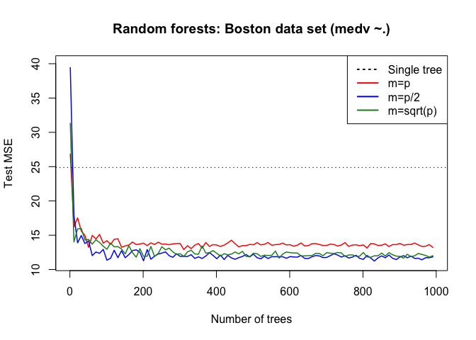
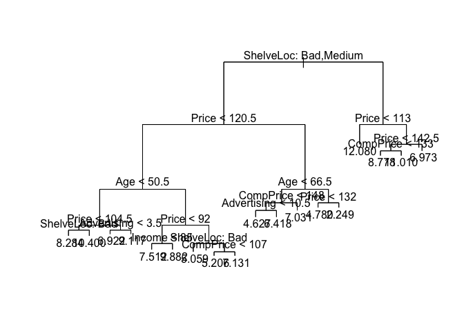
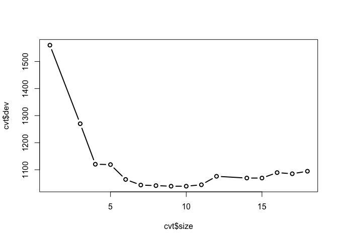
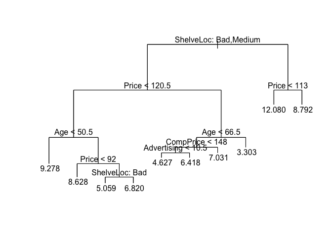
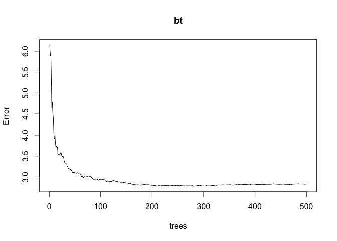
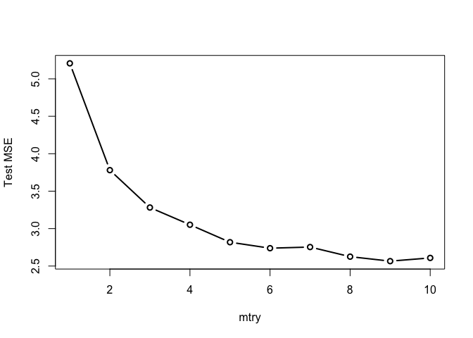
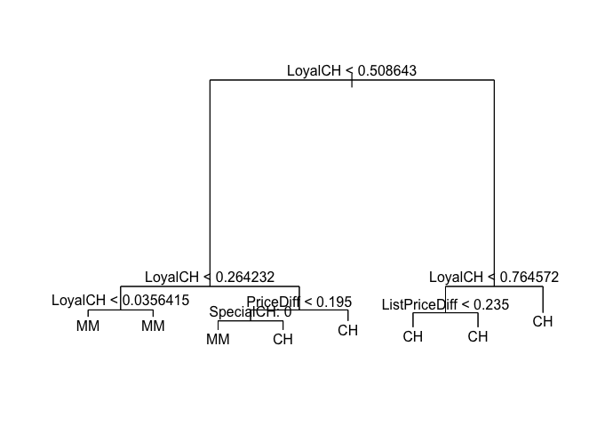
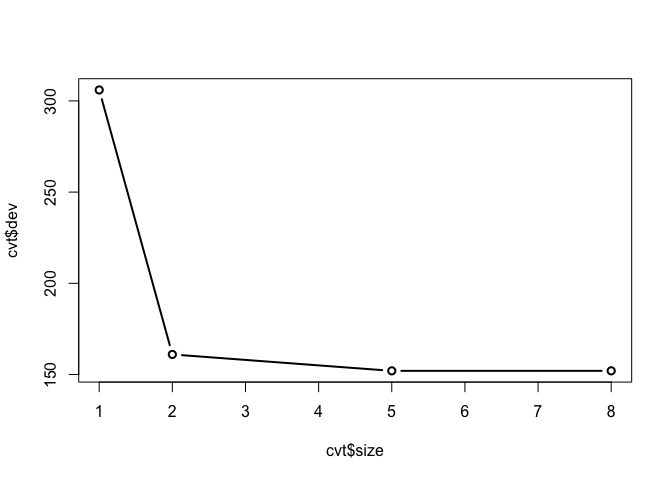
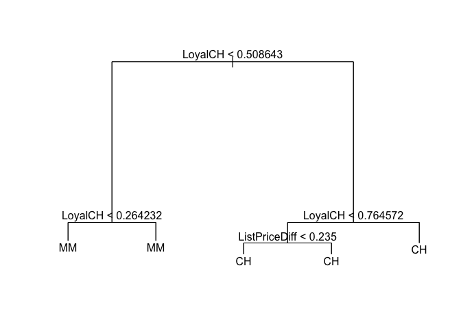

ISLR, Chapter 8
================

-   [Exercise 1](#exercise-1)
-   [Exercise 2](#exercise-2)
-   [Exercise 3](#exercise-3)
-   [Exercise 4](#exercise-4)
-   [Exercise 5](#exercise-5)
-   [Exercise 6](#exercise-6)
-   [Exercise 7](#exercise-7)
-   [Exercise 8](#exercise-8)
-   [Exercise 9](#exercise-9)
-   [Exercise 10](#exercise-10)
-   [Exercise 11](#exercise-11)
-   [Exercise 12](#exercise-12)

### Exercise 1

------------------------------------------------------------------------

### Exercise 2

------------------------------------------------------------------------

### Exercise 3

------------------------------------------------------------------------

### Exercise 4

------------------------------------------------------------------------

### Exercise 5

------------------------------------------------------------------------

### Exercise 6

------------------------------------------------------------------------

### Exercise 7

The plot below shows test MSE as a function of the number of trees for the Boston housing data set. Median house value was regressed on all other covariates (`p` = 13) or a subset of them (`p/2` and `sqrt(p)`). Each line shows the test MSE for a different value of `m`, the number of covariates selected randomly for each split. `m = p` represents bagging while `m < p` represents random forests. Random forests perform better than bagging with median test MSE values of `13.05` and `12.75` for `p/2` and `sqrt(p)` compared to `16.04` for `p`. Both performed better than a single tree which had a test MSE of `26.14`)

``` r
library(randomForest)
```

    ## randomForest 4.6-12

    ## Type rfNews() to see new features/changes/bug fixes.

``` r
library(tree)
library(MASS)
data(Boston)

set.seed(1)

boston.train.idx <- sample(nrow(Boston), 250)
boston.train <- Boston[boston.train.idx,]
boston.test <- Boston[-boston.train.idx,]

# Test MSE for a single decision tree
dt <- tree(medv ~ ., data=boston.train)
dtp <- predict(dt, newdata=boston.test[,1:(ncol(boston.test)-1)])
dtp.mse <- round(mean((dtp - boston.test[,14])^2),2)

# Test MSE for Random Forests for different values of `m` and number of trees
mtry.array <- c(13, round(13/2), round(sqrt(13)) )
ntree.array <- seq(1,1000, 10)
rf.mse <- matrix(nrow=length(mtry.array), ncol=length(ntree.array))
i <- 1
j <- 1

for (mtry in mtry.array) {
  for (ntree in ntree.array) {
    rf <- randomForest(
        medv ~ ., 
        data=boston.train, 
        xtest=boston.test[,1:(ncol(boston.test)-1)], 
        ytest=boston.test[,ncol(boston.test)],
        ntree=ntree,
        mtry=mtry,
        keep.forest=T
    )
    
    rf.mse[[i,j]] <- mean(rf$test$mse)
    j <- j+1
  }
  i <- i+1
  j = 1
}

# Plot test MSE as a function of number of trees for each `m`
ylim <- c(floor(min(rf.mse)), ceiling(max(rf.mse)))
plot(ntree.array, rf.mse[1,], type='l', col='red', lwd=1.5, ylim=ylim, main="Random forests: Boston data set (medv ~.)", xlab="Number of trees", ylab="Test MSE")
lines(ntree.array, rf.mse[2,], col='blue', lwd=1.5)
lines(ntree.array, rf.mse[3,], col='forestgreen', lwd=1.5)
legend("topright", legend=c('Single tree', 'm=p', 'm=p/2', 'm=sqrt(p)'), col=c("black", "red", "blue", "forestgreen"), lwd=2, lty=c('dotted', 'solid', 'solid', 'solid'))

abline(h=dtp.mse, lty='dotted')
```



------------------------------------------------------------------------

### Exercise 8

Fit regression trees to `Carseats` data using `Sales` as the response

``` r
library(ISLR)
data(Carseats)

library(tree)
library(randomForest)
```

*a:* Split data into training & test data sets

``` r
set.seed(1)
train.idx <- sample(nrow(Carseats), size=nrow(Carseats)/2)
carseats.train <- Carseats[train.idx,]
carseats.test <- Carseats[-train.idx,]
```

*b:* Fit decision tree to `Carseats` data. The resulting tree uses 6 covariates and has a test MSE of `4.15`. Plot of tree shows that `Sales` depends mainly on `ShelveLoc` and `Price`.

``` r
dt <- tree(Sales ~ ., data=carseats.train)
dtp <- predict(dt, newdata=carseats.test[,-1])
dtp.mse <- round(mean((dtp - carseats.test$Sales)^2), 2)
dtp.mse
```

    ## [1] 4.15

``` r
summary(dt)
```

    ## 
    ## Regression tree:
    ## tree(formula = Sales ~ ., data = carseats.train)
    ## Variables actually used in tree construction:
    ## [1] "ShelveLoc"   "Price"       "Age"         "Advertising" "Income"     
    ## [6] "CompPrice"  
    ## Number of terminal nodes:  18 
    ## Residual mean deviance:  2.36 = 429.5 / 182 
    ## Distribution of residuals:
    ##    Min. 1st Qu.  Median    Mean 3rd Qu.    Max. 
    ## -4.2570 -1.0360  0.1024  0.0000  0.9301  3.9130

``` r
plot(dt)
text(dt, pretty=0)
```



*c:* Cross-validation suggests that pruning the tree to 10 terminal nodes will give a simpler model without much loss of performance. This pruned tree uses 3 covariates and has a test MSE of `4.15`. Pruning the tree did not improve test MSE.

``` r
cvt <- cv.tree(dt, FUN=prune.tree)
plot(cvt$size, cvt$dev, type='b', lwd=2)
```



``` r
dt10 <- prune.tree(dt, best=10)
dt10p <- predict(dt10, newdata=carseats.test[,-1])
dt10p.mse <- round(mean((dtp - carseats.test$Sales)^2),2)
dt10p.mse
```

    ## [1] 4.15

``` r
summary(dt10)
```

    ## 
    ## Regression tree:
    ## snip.tree(tree = dt, nodes = c(39L, 11L, 8L, 18L, 7L))
    ## Variables actually used in tree construction:
    ## [1] "ShelveLoc"   "Price"       "Age"         "CompPrice"   "Advertising"
    ## Number of terminal nodes:  10 
    ## Residual mean deviance:  3.103 = 589.6 / 190 
    ## Distribution of residuals:
    ##     Min.  1st Qu.   Median     Mean  3rd Qu.     Max. 
    ## -5.21200 -1.12000  0.04154  0.00000  0.99360  4.59800

``` r
plot(dt10)
text(dt10, pretty = 0)
```



*d:* Using bagging to fit the data with 500 trees results in a decrease in test MSE to ~ `2.5`. The most importance variables according to bagging are `Price`, `ShelveLoc`, `Age` & `CompPrice`, the same covariates used in the pruned tree above wihth 8 terminal nodes.

``` r
bt <- randomForest(Sales ~ ., data=carseats.train, mtry=10, xtest=carseats.test[,-1], ytest=carseats.test[,1])
plot(bt)
```



``` r
bt.mse <- median(bt$test$mse)
print(bt.mse)
```

    ## [1] 2.590532

``` r
importance(bt, type=2)
```

    ##             IncNodePurity
    ## CompPrice      135.127054
    ## Income          80.643994
    ## Advertising    122.228618
    ## Population      60.438683
    ## Price          508.357941
    ## ShelveLoc      320.225810
    ## Age            196.492778
    ## Education       40.502415
    ## Urban            9.471977
    ## US              17.136974

*e:* Random forests with 500 trees were used to fit the data. Test MSE decreased with increase in number of covariates considered at each split with the lowest test MSE occuring when all covariates were used at each split (same as bagging). For each value of `m`, `ShelveLoc`, `Price` and `Age` were the most important covariates.

``` r
p <- ncol(Carseats) - 1
mtry.array <- 1:10
rf.mse <- rep(NaN, length(mtry.array))
i <- 1

for (mtry in mtry.array) {
  rf <- randomForest(Sales ~ ., data=carseats.train, mtry=mtry, xtest=carseats.test[,-1], ytest=carseats.test[,1])
  mse <- median(rf$test$mse)
  rf.mse[[i]] <- mse
  
  print(importance(rf))
  
  i <- i + 1
}
```

    ##             IncNodePurity
    ## CompPrice       105.32366
    ## Income          112.95047
    ## Advertising     106.36679
    ## Population       94.73644
    ## Price           199.50190
    ## ShelveLoc       134.03874
    ## Age             139.02084
    ## Education        68.64173
    ## Urban            19.15073
    ## US               40.07168
    ##             IncNodePurity
    ## CompPrice       129.28631
    ## Income          139.51034
    ## Advertising     138.49776
    ## Population      115.36117
    ## Price           330.46741
    ## ShelveLoc       207.62506
    ## Age             192.82418
    ## Education        74.77272
    ## Urban            17.96119
    ## US               35.08195
    ##             IncNodePurity
    ## CompPrice       129.13559
    ## Income          129.78716
    ## Advertising     139.81641
    ## Population       97.08528
    ## Price           378.63489
    ## ShelveLoc       240.73461
    ## Age             198.82917
    ## Education        66.58414
    ## Urban            14.95663
    ## US               31.93268
    ##             IncNodePurity
    ## CompPrice       127.34192
    ## Income          112.47033
    ## Advertising     140.52326
    ## Population       89.04572
    ## Price           422.52167
    ## ShelveLoc       258.36763
    ## Age             194.87026
    ## Education        61.78514
    ## Urban            12.78019
    ## US               28.07533
    ##             IncNodePurity
    ## CompPrice       126.62612
    ## Income          102.72355
    ## Advertising     138.79678
    ## Population       75.50042
    ## Price           451.11218
    ## ShelveLoc       279.09863
    ## Age             195.70399
    ## Education        56.69925
    ## Urban            10.79535
    ## US               20.82482
    ##             IncNodePurity
    ## CompPrice       129.27934
    ## Income           93.96078
    ## Advertising     135.39868
    ## Population       69.95139
    ## Price           469.65732
    ## ShelveLoc       288.31762
    ## Age             192.74831
    ## Education        50.31297
    ## Urban            10.60214
    ## US               20.67307
    ##             IncNodePurity
    ## CompPrice       123.47919
    ## Income           92.46310
    ## Advertising     131.85783
    ## Population       67.92354
    ## Price           476.74817
    ## ShelveLoc       296.45792
    ## Age             198.45158
    ## Education        48.23252
    ## Urban            10.27862
    ## US               19.97420
    ##             IncNodePurity
    ## CompPrice      132.133896
    ## Income          81.550557
    ## Advertising    132.914412
    ## Population      65.283860
    ## Price          492.292894
    ## ShelveLoc      301.391535
    ## Age            197.485763
    ## Education       45.914010
    ## Urban            9.463372
    ## US              15.097896
    ##             IncNodePurity
    ## CompPrice      132.627105
    ## Income          77.131367
    ## Advertising    128.506198
    ## Population      63.464150
    ## Price          502.721975
    ## ShelveLoc      313.209168
    ## Age            189.063853
    ## Education       43.100182
    ## Urban            9.274401
    ## US              15.176180
    ##             IncNodePurity
    ## CompPrice      138.773774
    ## Income          76.672544
    ## Advertising    126.558160
    ## Population      61.707802
    ## Price          505.967027
    ## ShelveLoc      319.420411
    ## Age            193.111108
    ## Education       41.422149
    ## Urban            8.409798
    ## US              13.642901

``` r
df <- data.frame(mtry=mtry.array, mse=rf.mse)
plot(df, type='b', lwd=2, ylab='Test MSE')
```



------------------------------------------------------------------------

### Exercise 9

Explore the `OJ` data set

*a:* Create training and test sets

``` r
library(tree)
library(randomForest)
library(ISLR)
data(OJ)

OJ$StoreID <- as.factor(OJ$StoreID)
OJ$SpecialCH <- as.factor(OJ$SpecialCH)
OJ$SpecialMM <- as.factor(OJ$SpecialMM)
OJ$Store7 <- as.factor(OJ$Store7)
OJ$STORE <- as.factor(OJ$STORE)

set.seed(1)
train.idx <- sample(nrow(OJ), size=800)
oj.train <- OJ[train.idx, ]
oj.test <- OJ[-train.idx,]
```

*b:* A decision tree fit to the data had 8 terminal nodes. Only the covariates `LoyalCH`, `PriceDiff`, `SpecialCH` and `ListPriceDiff` were used. Training misclassification error rate is `0.165 (16.5%)` and residual mean deviance is `0.7305`.

``` r
dt <- tree(Purchase ~ ., data=oj.train)
summary(dt)
```

    ## 
    ## Classification tree:
    ## tree(formula = Purchase ~ ., data = oj.train)
    ## Variables actually used in tree construction:
    ## [1] "LoyalCH"       "PriceDiff"     "SpecialCH"     "ListPriceDiff"
    ## Number of terminal nodes:  8 
    ## Residual mean deviance:  0.7305 = 578.6 / 792 
    ## Misclassification error rate: 0.165 = 132 / 800

*c:* Terminal node details. Terminal node `7` contains only data points with `LoyalCH > 0.764572`. This node has a deviance of `86.14` and a fitted value of `CH`. It has `278` data points of which `96.4%` have `Purchase = CH` and `3.6%` have `Purchase = MM`.

``` r
dt
```

    ## node), split, n, deviance, yval, (yprob)
    ##       * denotes terminal node
    ## 
    ##  1) root 800 1064.00 CH ( 0.61750 0.38250 )  
    ##    2) LoyalCH < 0.508643 350  409.30 MM ( 0.27143 0.72857 )  
    ##      4) LoyalCH < 0.264232 166  122.10 MM ( 0.12048 0.87952 )  
    ##        8) LoyalCH < 0.0356415 57   10.07 MM ( 0.01754 0.98246 ) *
    ##        9) LoyalCH > 0.0356415 109  100.90 MM ( 0.17431 0.82569 ) *
    ##      5) LoyalCH > 0.264232 184  248.80 MM ( 0.40761 0.59239 )  
    ##       10) PriceDiff < 0.195 83   91.66 MM ( 0.24096 0.75904 )  
    ##         20) SpecialCH: 0 70   60.89 MM ( 0.15714 0.84286 ) *
    ##         21) SpecialCH: 1 13   16.05 CH ( 0.69231 0.30769 ) *
    ##       11) PriceDiff > 0.195 101  139.20 CH ( 0.54455 0.45545 ) *
    ##    3) LoyalCH > 0.508643 450  318.10 CH ( 0.88667 0.11333 )  
    ##      6) LoyalCH < 0.764572 172  188.90 CH ( 0.76163 0.23837 )  
    ##       12) ListPriceDiff < 0.235 70   95.61 CH ( 0.57143 0.42857 ) *
    ##       13) ListPriceDiff > 0.235 102   69.76 CH ( 0.89216 0.10784 ) *
    ##      7) LoyalCH > 0.764572 278   86.14 CH ( 0.96403 0.03597 ) *

*d:* A plot of the tree indicates that `LoyalCH` is the most important covariate and is used in the first 2 levels of the tree. Data points with `LoyalCH > 0.5` are associated with `CH` purchases while points with `LoyalCH < 0.26` are associated with `MM` purchases.

``` r
plot(dt)
text(dt, pretty=0)
```



*e:* Predictions are thresholded at 0.8, i.e., if `P(CH) >= 0.8`, then the prediction is classified as `CH`, else `MM`. With this threshold value, the test misclassification error rate is `23.7%`.

``` r
dtp <- predict(dt, newdata=oj.test[,-1])
dtp.class <- ifelse(dtp[,1] >= 0.8, 'CHp', 'MMp')
cm <- table(oj.test$Purchase, dtp.class)
print(cm) 
```

    ##     dtp.class
    ##      CHp MMp
    ##   CH 107  52
    ##   MM  12  99

``` r
err <- (cm[1,2] + cm[2,1])/sum(cm)
print(err)
```

    ## [1] 0.237037

*f/g/h:* Cross-validation suggests that a tree with 5 terminal nodes is the smallest tree with the lowest misclassification error rate.

``` r
set.seed(1)
cvt <- cv.tree(dt, FUN=prune.misclass)
print(cvt)
```

    ## $size
    ## [1] 8 5 2 1
    ## 
    ## $dev
    ## [1] 152 152 161 306
    ## 
    ## $k
    ## [1]       -Inf   0.000000   4.666667 160.000000
    ## 
    ## $method
    ## [1] "misclass"
    ## 
    ## attr(,"class")
    ## [1] "prune"         "tree.sequence"

``` r
plot(cvt$size, cvt$dev, type='b', lwd=2)
```



*i/j/k:* Compare pruned & unpruned trees. The training error rate for a pruned tree with 5 terminal nodes is `0.1825`, higher than that for the unpruned tree (`0.165`). The test misclassification error rate for both trees is the same (`0.237`).

``` r
dt.pruned <- prune.tree(dt, best=5)
summary(dt.pruned)
```

    ## 
    ## Classification tree:
    ## snip.tree(tree = dt, nodes = 4:5)
    ## Variables actually used in tree construction:
    ## [1] "LoyalCH"       "ListPriceDiff"
    ## Number of terminal nodes:  5 
    ## Residual mean deviance:  0.7829 = 622.4 / 795 
    ## Misclassification error rate: 0.1825 = 146 / 800

``` r
plot(dt.pruned)
text(dt.pruned, pretty=0)
```



``` r
dt.pruned.p <- predict(dt.pruned, newdata=oj.test[,-1])
dtp.pruned.class <- ifelse(dt.pruned.p[,1] >= 0.8, 'CHp', 'MMp')
cm.pruned <- table(oj.test$Purchase, dtp.pruned.class)
print(cm.pruned) 
```

    ##     dtp.pruned.class
    ##      CHp MMp
    ##   CH 107  52
    ##   MM  12  99

``` r
err.pruned <- (cm.pruned[1,2] + cm.pruned[2,1])/sum(cm.pruned)
print(err.pruned)
```

    ## [1] 0.237037

------------------------------------------------------------------------

### Exercise 10

------------------------------------------------------------------------

### Exercise 11

------------------------------------------------------------------------

### Exercise 12
