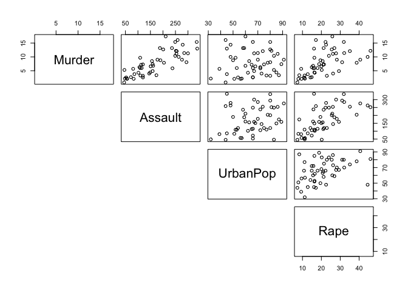
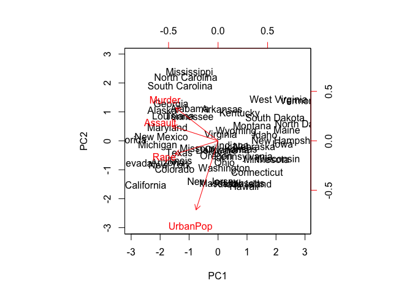
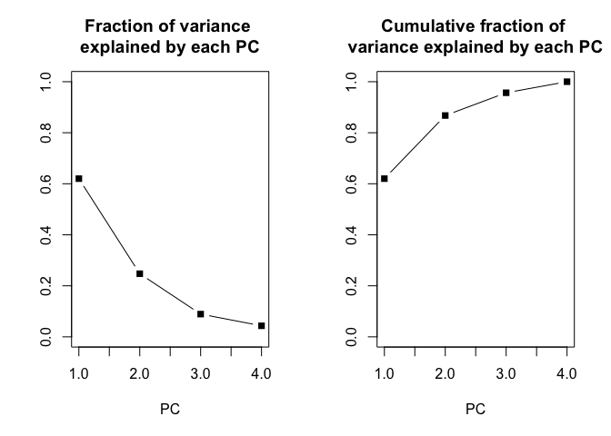

ISLR, Chapter 10
================

### Explore `USArrests`

``` r
# Columns
# 
# Murder - Murder arrests (per 100,000)
# Assault - Assault arrests (per 100,000)
# UrbanPop - Percent urban population
# Rape - Rape arrests (per 100,000)

dim(USArrests)
```

    ## [1] 50  4

``` r
names(USArrests)
```

    ## [1] "Murder"   "Assault"  "UrbanPop" "Rape"

``` r
# Crime rates across all states - mean & sd
apply(USArrests, 2, mean)
```

    ##   Murder  Assault UrbanPop     Rape 
    ##    7.788  170.760   65.540   21.232

``` r
apply(USArrests, 2, var)
```

    ##     Murder    Assault   UrbanPop       Rape 
    ##   18.97047 6945.16571  209.51878   87.72916

``` r
# UrbanPop is not comparable to other covariates which are measured per 100,000 individuals
# UrbanPop also has very high variance compared to other covariates and will dominate the PCs
# Solution is to scale all covariates to have mean 0 and variance 1
pairs(USArrests, lower.panel=NULL)
```



``` r
# mean-centering is performed by default
# scale=TRUE => scale to have sd = 1
pr.out <- prcomp(USArrests, scale=TRUE) 
dim(pr.out)
```

    ## NULL

``` r
names(pr.out)
```

    ## [1] "sdev"     "rotation" "center"   "scale"    "x"

``` r
# [1] "sdev"     "rotation" "center"   "scale"    "x"    
# 
# rotation = matrix of PC loadings, i.e., weights by which each covariate must be multiplied to get PC
# x = PC score vectors as columns, i.e., rotation x data

biplot(pr.out, scale=0)
```



``` r
# Variance explained by each PC
v = pr.out$sdev^2
v
```

    ## [1] 2.4802416 0.9897652 0.3565632 0.1734301

``` r
# Fraction of variance explained by each PC
pve = v/sum(v)

par(mfrow=c(1,2))
plot(pve, main="Fraction of variance \nexplained by each PC", xlab="PC", ylab="", ylim=c(0,1), pch=15, type='b')

plot(cumsum(pve), main="Cumulative fraction of \nvariance explained by each PC", xlab="PC", ylab="", ylim=c(0,1), pch=15, type='b')
```


